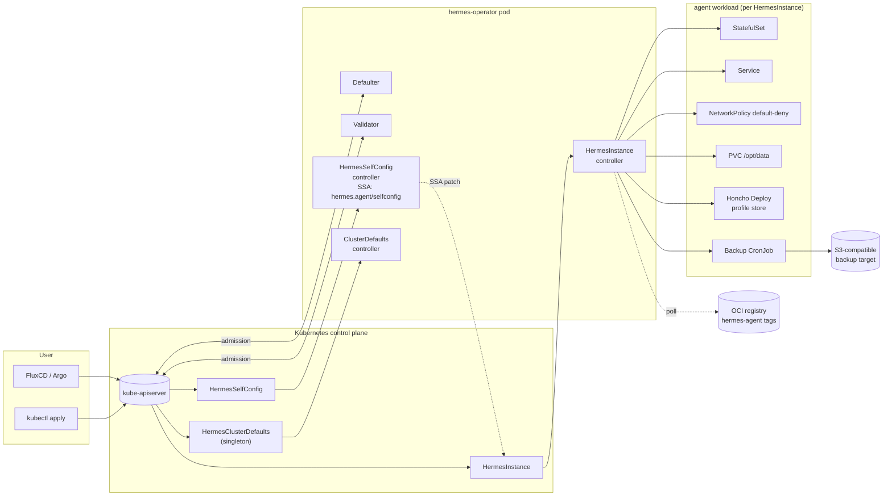

# Hermes Operator

<p align="center">
  <a href="LICENSE"></a>
  <a href="https://goreportcard.com/report/github.com/ubc/hermes-operator"></a>
  <a href="https://github.com/ubc/hermes-operator/actions/workflows/ci.yaml"></a>
  <a href="https://github.com/ubc/hermes-operator/actions/workflows/e2e.yaml"></a>
  <a href="https://github.com/ubc/hermes-operator/actions/workflows/conformance.yaml"></a>
  <a href="https://github.com/ubc/hermes-operator/releases/latest"></a>
  <a href="#supported-kubernetes-versions"></a>
  <a href="go.mod"></a>
  <a href="https://api.securityscorecards.dev/projects/github.com/ubc/hermes-operator"></a>
  <a href="https://artifacthub.io/packages/search?repo=hermes-operator"></a>
</p>

Kubernetes operator for [nousresearch/hermes-agent](https://github.com/nousresearch/hermes-agent): a Python-based self-improving multi-platform AI agent. Declarative spec,
opinionated security defaults, S3 backups, OCI-registry auto-update,
SSA-based GitOps coexistence, and a one-shot migration path from
openclaw-operator.

`hermes-operator` ships as v1.0.0 with [v1 stability commitments](docs/api-versioning.md)
in place from day one: no v0.x grind.

> Inspired by [openclaw-rocks/openclaw-operator](https://github.com/openclaw-rocks/openclaw-operator);
> openclaw lessons #437, #446, #433, #471, #479, #458, #469 (and many more)
> informed concrete guardrails baked into v1. See
> [docs/superpowers/specs/2026-05-12-hermes-operator-design.md](docs/superpowers/specs/2026-05-12-hermes-operator-design.md) §1.G3.

## Quickstart

```bash
# 1. Install the CRDs and operator via Helm (OCI chart; Helm 3.8+).
#    Omit --version for the latest release, or add --version X.Y.Z to pin.
helm install hermes-operator \
  oci://ghcr.io/ubc/charts/hermes-operator \
  -n hermes-operator --create-namespace

# 2. Apply a minimal instance. The agent runs the upstream NousResearch/hermes-agent
#    s6 image (gateway + OpenAI-compatible API server), with /health on port 8443.
kubectl apply -n agents -f - <<'YAML'
apiVersion: hermes.agent/v1
kind: HermesInstance
metadata:
  name: my-hermes
spec:
  image:
    repository: ghcr.io/ubc/hermes-agent
    tag: "v0.16.0"
  # Point the gateway at an LLM provider and inject the key via spec.env.
  config:
    raw:
      model: gpt-4o-mini
      base_url: https://api.openai.com/v1
  env:
    - name: OPENAI_API_KEY
      valueFrom:
        secretKeyRef:
          name: hermes-llm
          key: apiKey
  storage:
    persistence:
      enabled: true
      size: 10Gi
YAML

# 3. Watch it converge.
kubectl get hi -n agents -w
# NAME        READY   PHASE   IMAGE                                AGE
# my-hermes   True    Ready   ghcr.io/ubc/hermes-agent:v0.16.0    30s
```

If you omit `spec.config.raw.model`, the operator injects a non-routable placeholder
so the gateway and API server still come up (and `/health` passes) without making
live LLM calls; inference then fails clearly until a real provider is set. Each
instance also gets an operator-managed random `api_server_key` (in its
`<name>-gateway-tokens` Secret) that authenticates the OpenAI-compatible
`/v1/...` API; `/health` is unauthenticated. See [Agent runtime](docs/runtime.md).

For more involved scenarios, see [`examples/`](examples/).

## Architecture



The agent runs as a StatefulSet (single replica by default) under a default-
deny NetworkPolicy. The `HermesSelfConfig` controller uses Server-Side Apply
under field manager `hermes.agent/selfconfig`, so FluxCD/Argo can own the
parent `HermesInstance` for other fields without flap. `HermesClusterDefaults`
is a cluster-scoped singleton (name **must** be `cluster`) that fills `nil`
fields only: explicit values on the instance always win.

## Features

| Area | Feature | Notes |
|---|---|---|
| **Declarative** | Single `HermesInstance` CR drives the whole stack | StatefulSet, Service, PVC, NetworkPolicy, ConfigMap, PDB, HPA, ServiceMonitor, Honcho deploy, backup CronJob: all owned and reconciled. |
| **Declarative** | `HermesClusterDefaults` for cluster-wide defaults | Defaulting webhook fills `nil` fields only. |
| **Adaptive** | `HermesSelfConfig` for audited agent-initiated mutations | SSA under field manager `hermes.agent/selfconfig`. Policy-gated by `spec.selfConfigure.protectedKeys`. |
| **Adaptive** | OCI-registry-driven auto-update | Channel-pinned polling, pre-update backup, probe-failure rollback. |
| **Secure** | Default-deny NetworkPolicy + per-gateway allow rules | Derived from `spec.gateways` and `spec.networking.egress`. |
| **Secure** | Hardened container security context | The upstream s6 runtime starts as root so `/init` (PID 1) can remap the in-image user to uid/gid 1000 and chown `/opt/data`, then every service drops to uid 1000 via `s6-setuidgid`. `allowPrivilegeEscalation=false`, `fsGroup=1000`, and seccomp `RuntimeDefault` remain; `runAsNonRoot`/read-only rootfs/drop-ALL-caps are not set (s6 needs `CHOWN`/`SETUID`/`SETGID`/`DAC_OVERRIDE`/`FOWNER` and a writable `/run`). Requires an SCC that permits a root-start container (e.g. `anyuid`); incompatible with OpenShift `restricted`/`restricted-v2`. See [Agent runtime](docs/runtime.md). |
| **Secure** | Optional Tailscale Serve sidecar | Per-instance MagicDNS hostname + Tailscale TLS cert, no LoadBalancer/Ingress. See [Tailscale Serve](#tailscale-serve). |
| **Secure** | Per-CRD validating + defaulting webhooks | Plus warnings on unknown config keys and unresolvable gateway tokens. |
| **Secure** | RBAC aggregation labels | `kubectl auth can-i create hermesinstances --as=jane` works out of the box. |
| **Secure** | Image signing + SBOM | Cosign keyless OIDC, SPDX SBOM on every release. |
| **Observable** | Prometheus metrics + ServiceMonitor | Per-controller, per-instance, per-subsystem. `metrics.secure` consistent. |
| **Observable** | [Grafana dashboard](docs/grafana/) | Ships as JSON. Variables: `namespace`, `instance`. |
| **Observable** | Exhaustive [condition catalogue](docs/conditions.md) | Every condition × every reason code, documented and stable. |
| **Multi-platform** | Telegram / Discord / Slack / WhatsApp / Signal gateways | First-class `spec.gateways.*` sections, secret-rotation-friendly. |
| **Upstream runtime** | Ships the supported NousResearch/hermes-agent s6 image | The published `ghcr.io/ubc/hermes-agent` is built `FROM` the upstream image (pinned by digest). It bundles the gateway, dashboard, OpenAI-compatible API server, a Playwright/Chromium browser, node, ffmpeg, and all Python deps. No init-container venv build — the old `uv sync` / `init-apt`/`init-uv`/`init-pip` chain is gone. See [Agent runtime](docs/runtime.md). |
| **Upstream runtime** | FFmpeg, ripgrep, browser, node available out of the box | Bundled in the upstream hermes-agent image. |
| **Scalable** | Optional HPA via `spec.availability.hpa` | StatefulSet retained for identity through restarts. |
| **Scalable** | Optional `topologySpreadConstraints` | Sane defaults plus `spec.availability.topologySpreadConstraints` override. |
| **Resilient** | PodDisruptionBudget auto-managed when `replicas > 1` | |
| **Resilient** | Finalizer-driven backup-on-delete | `r.Patch` (JSON patch) for finalizer mutations, never `r.Update`. |
| **Resilient** | Zombie-process reaper | s6-overlay `/init` as PID 1 reaps zombies; `shareProcessNamespace: false` by default (its `/init` must be PID 1). |
| **Backup / Restore** | S3-compatible backups | Scheduled, on-delete, pre-update. `tar.zst` snapshots + `meta.json`. |
| **Backup / Restore** | Declarative one-shot restore | `spec.restoreFrom` is immutable once applied. |
| **Migration** | One-shot OpenClaw → Hermes migration | From sibling `OpenClawInstance` or S3 backup. Uses hermes-agent's importer. |
| **Profile store** | Optional Honcho companion | Deployment + Service + PVC + secret, fully managed. |
| **Gateway auth** | Per-platform `secretRef` for tokens | Rotate independently, audited via webhook warnings. |
| **Cloud-native** | Helm chart, OLM bundle, plain kustomize manifests | All three are first-class. CRDs templated under the Helm chart. |
| **Cloud-native** | Multi-arch (`amd64`+`arm64`), Cosign-signed, SBOM-attested | |
| **GitOps** | SSA-based SelfConfig coexists with Argo/Flux | No flap on shared instances. |
| **Stability** | v1.0 ships with [versioning](docs/api-versioning.md) + [deprecation](docs/deprecations.md) policies | Conversion-webhook scaffolding in place for future v2. |

## Tailscale Serve

Set `spec.tailscale.enabled=true` to expose the gateway on your private
tailnet. The operator injects a `tailscale` sidecar running
[Tailscale Serve](https://tailscale.com/kb/1312/serve): each instance gets its
own MagicDNS hostname (`https://<hostname>.<tailnet>.ts.net`) with a
Tailscale-issued TLS certificate, terminated in the sidecar and proxied to the
gateway over localhost. No LoadBalancer or Ingress is needed. The field is
additive: the existing Service is unchanged.

```yaml
spec:
  tailscale:
    enabled: true
    mode: serve          # only "serve" is implemented today
    hostname: my-hermes  # MagicDNS hostname; defaults to metadata.name
    authKey:
      secretRef:
        name: hermes-tailscale
        key: authKey
    # image.{repository,tag,pullPolicy} and resources are also available.
```

Requirements and notes:

- **Auth key.** `authKey.secretRef` is required and must reference a
  **reusable + ephemeral** [Tailscale auth key](https://tailscale.com/kb/1085/auth-keys).
  Ephemeral means the node auto-removes from the tailnet when the pod stops;
  reusable means the sidecar re-registers under the same stable hostname on
  restart. The validating webhook rejects `enabled=true` without a
  `secretRef` and warns when the Secret or key does not resolve.
- **Tailnet prerequisites.** MagicDNS and HTTPS certificates must be enabled
  on the tailnet: Serve waits for `TS_CERT_DOMAIN` and never becomes ready
  without them.
- **NetworkPolicy.** When the operator-managed NetworkPolicy is enabled, it
  gains UDP egress on 3478 (STUN) and 41641 (WireGuard) for direct
  connections. If the network blocks UDP, Tailscale falls back to DERP relays
  over TCP/443, which the policy already allows.
- **Reserved names.** User sidecars must not be named `tailscale`, and
  `extraVolumes` must not be named `tailscale-serve` or `tailscale-tmp`: the
  webhook rejects them.

The sidecar's wiring status is reported via the `TailscaleReady` condition.
See [`docs/api-reference.md`](docs/api-reference.md#spectailscale) for the
full field list.

## Worked example: self-configure

The agent can persist a learned skill, env var, config patch, workspace file,
or Honcho profile by creating a `HermesSelfConfig` in its namespace. The
operator validates against the parent instance's `selfConfigure.protectedKeys`
allowlist and applies via SSA:

```yaml
apiVersion: hermes.agent/v1
kind: HermesSelfConfig
metadata:
  name: install-finance-skill
  namespace: agents
spec:
  instanceRef: my-hermes
  addSkills:
    - source: "git+https://github.com/foo/finance-skill@v1.2.0"
  patchConfig:
    schedules:
      morning-brief: "0 8 * * *"
  addEnvVars:
    - name: FINANCE_TZ
      value: Europe/Berlin
```

Apply, then watch:

```bash
kubectl get hsc -n agents
# NAME                      PHASE     INSTANCE    AGE
# install-finance-skill     Applied   my-hermes   3s
```

The audit trail lives in `kubectl describe hsc install-finance-skill` and on
the instance via the per-field SSA field manager
`hermes.agent/selfconfig`: `kubectl get hi my-hermes -o jsonpath='{.metadata.managedFields}'`
shows exactly which fields the agent owns vs. Flux owns vs. you own.

See [`examples/`](examples/) for end-to-end recipes.

## Supported Kubernetes versions

| Operator | Kubernetes |
|---|---|
| v1.x | 1.28, 1.29, 1.30, 1.31, 1.32 |

We drop the oldest k8s minor when Kubernetes EOLs it, on the *next* operator
minor release. Patch releases never change the supported matrix.

## Distribution

| Channel | What |
|---|---|
| Helm (OCI) | `helm install hermes-operator oci://ghcr.io/ubc/charts/hermes-operator` |
| OLM / OperatorHub | `kubectl operator install hermes-operator` (pending first OperatorHub release) |
| Plain manifests | `kubectl apply -f https://github.com/ubc/hermes-operator/releases/latest/download/install.yaml` |
| Container image | `ghcr.io/ubc/hermes-operator:v0.1.9` (multi-arch, Cosign-signed, SBOM attested) |

## Documentation

- [Design spec](docs/superpowers/specs/2026-05-12-hermes-operator-design.md): the canonical product/architecture doc.
- [API reference](docs/api-reference.md): every field on every CR.
- [Condition catalogue](docs/conditions.md): every status condition, reason code, troubleshooting hint.
- [API versioning policy](docs/api-versioning.md): what is and is not a breaking change.
- [Deprecation policy](docs/deprecations.md): the 3-step flow + active deprecations.
- [Roadmap](ROADMAP.md): shipped, planned, future, non-goals.
- [Examples](examples/): 9 worked YAML recipes.
- [Grafana dashboard](docs/grafana/): operator-overview dashboard JSON.

## Contributing

See [`CONTRIBUTING.md`](CONTRIBUTING.md). Pull requests follow
[Conventional Commits](https://www.conventionalcommits.org/) (`feat:`, `fix:`,
`docs:`, `ci:`, `chore:`, `refactor:`, `test:`); release-please drives the
release-PR loop from `feat:`/`fix:`.

## Security

See [`SECURITY.md`](SECURITY.md). Report vulnerabilities via the GitHub
security advisory flow; do not file public issues for security bugs.

## License

Apache-2.0. See [`LICENSE`](LICENSE).
