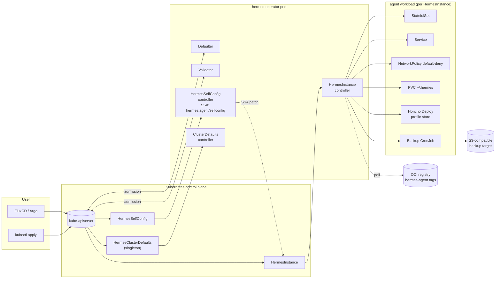

# Hermes Operator — Plan 7: v1 Stability Docs, Polish, and v1.0.0 Cut

> **For agentic workers:** REQUIRED SUB-SKILL: Use `superpowers:subagent-driven-development` (recommended) or `superpowers:executing-plans` to implement this plan task-by-task. Steps use checkbox (`- [ ]`) syntax for tracking.

**Goal:** Earn the v1 label — publish the formal API-versioning and deprecation policies, finalise the exhaustive condition catalogue, build a polished README + public ROADMAP, ship a complete `examples/` directory and a Grafana dashboard, cut and release `v1.0.0` via release-please/GoReleaser, track the OperatorHub PRs through merge, and (on user confirmation) flip the repo public.

**Architecture:** Plan 7 is almost entirely documentation, example YAML, and release ceremony — no new controllers, no new builders, no new conditions. It consolidates the surfaces that Plans 1–6 leave as TODOs: `docs/api-versioning.md`, `docs/deprecations.md`, `docs/conditions.md`, `ROADMAP.md`, `examples/**`, `docs/grafana/`, the v1.0.0 `CHANGELOG.md` entry, the GoReleaser/OperatorHub release watch, and a launch-announcement draft. The repo-public flip is a gated user-confirmed step at the very end. Where Plans 2–6 left stub entries in `docs/conditions.md`, this plan rewrites the file from the aggregated catalogue and verifies nothing was missed. The README that Plan 1 created as a minimal "what this is" file becomes the v1-quality landing page modelled on the openclaw-operator shape but with hermes content (no openclaw text copied; the shape only).

**Tech Stack:** Markdown (CommonMark + GitHub-flavoured tables), Mermaid diagrams, YAML (Kubernetes manifests for examples), Grafana dashboard JSON (schemaVersion 39), GitHub CLI (`gh`) for release/PR tracking, release-please + GoReleaser (driven by Plan 6's workflows). No new Go code.

**Prerequisite:** Plans 1–6 merged. All conformance jobs green on main. release-please workflow installed (Plan 6). GoReleaser workflow installed (Plan 6). OperatorHub-submission workflow installed (Plan 6). `gh` CLI authenticated locally as the repo owner.

**Spec reference:** `docs/superpowers/specs/2026-05-12-hermes-operator-design.md` §11, §12.

---

## File Structure Established by This Plan

```
hermes-operator/
├── README.md                                # MODIFY: promote Plan 1 stub to v1-quality landing page (Task 11)
├── ROADMAP.md                               # NEW: shipped / planned / future / non-goals (Task 10)
├── CHANGELOG.md                             # MODIFY: release-please-generated v1.0.0 entry, polished (Task 18)
├── docs/
│   ├── api-versioning.md                    # NEW: formal versioning policy (Task 1)
│   ├── deprecations.md                      # NEW: deprecation policy + active-deprecation tracker (Task 2)
│   ├── conditions.md                        # REWRITE: aggregated, exhaustive condition catalogue (Tasks 3–9)
│   ├── launch-announcement.md               # NEW: short launch announcement draft (Task 20)
│   ├── post-launch-checklist.md             # NEW: first-30-days checklist (Task 22)
│   └── grafana/
│       ├── README.md                        # NEW: import + variables (Task 16)
│       └── hermes-operator-overview.json    # NEW: Grafana dashboard JSON (Task 15)
├── examples/
│   ├── README.md                            # NEW: index of examples (Task 12)
│   ├── minimal/
│   │   ├── README.md
│   │   └── hermesinstance.yaml              # (Task 12)
│   ├── full-featured/
│   │   ├── README.md
│   │   └── hermesinstance.yaml              # (Task 12)
│   ├── multi-platform/
│   │   ├── README.md
│   │   ├── secrets.yaml
│   │   └── hermesinstance.yaml              # (Task 13)
│   ├── honcho/
│   │   ├── README.md
│   │   └── hermesinstance.yaml              # (Task 13)
│   ├── auto-update/
│   │   ├── README.md
│   │   └── hermesinstance.yaml              # (Task 13)
│   ├── backup-s3/
│   │   ├── README.md
│   │   ├── minio.yaml
│   │   ├── s3-credentials.yaml
│   │   └── hermesinstance.yaml              # (Task 14)
│   ├── migration-from-openclaw/
│   │   ├── README.md
│   │   ├── from-sibling.yaml
│   │   └── from-backup.yaml                 # (Task 14)
│   ├── gitops-fluxcd/
│   │   ├── README.md
│   │   ├── gitrepository.yaml
│   │   ├── kustomization.yaml
│   │   └── hermesinstance.yaml              # (Task 14)
│   └── cluster-defaults/
│       ├── README.md
│       └── clusterdefaults.yaml             # (Task 14)
└── (release artefacts, not files)           # release-please PR, GoReleaser run, OperatorHub PRs (Tasks 17–19, 21)
```

Roughly 25 new markdown/YAML/JSON files; one README rewrite; one `CHANGELOG.md` polish pass over what release-please generated; zero Go file changes.

---

## Task 1: `docs/api-versioning.md` — formal versioning policy

**Files:**
- Create: `docs/api-versioning.md`

This is the canonical document spec §11.1 commits to. It must say, in writing, that `hermes.agent/v1` will not break for the lifetime of v1.x, and it must define what "break" means in operational terms (so a future contributor can read it and know whether a proposed change is allowed).

- [ ] **Step 1: Confirm we are working off the latest main**

```bash
git checkout main
git pull --ff-only
git checkout -b docs/api-versioning
```

- [ ] **Step 2: Write `docs/api-versioning.md` end-to-end**

Create the file with this exact content (no placeholders):

```markdown
# Hermes Operator — API Versioning Policy

> Canonical policy for the `hermes.agent` API group. This document governs every
> change to `HermesInstance`, `HermesSelfConfig`, and `HermesClusterDefaults`
> for the lifetime of v1.x. Pull requests that change CRD types are reviewed
> against this document.

## TL;DR

- **API group:** `hermes.agent`.
- **Served versions in v1.x:** `v1` (storage = hub).
- **No `v1alpha1` / `v1beta1` spoke.** v1 ships as the only version.
- **`hermes.agent/v1` will not have breaking changes for the lifetime of v1.x.**
  A breaking change requires `hermes.agent/v2` plus a conversion webhook and at
  least 6 months of overlap (see §"Breaking changes").
- **New optional fields are non-breaking** and may be added in any minor
  release. Required-field additions are breaking.

## Scope

This policy covers:

- CRD schemas (the OpenAPI under `config/crd/bases/`).
- Status condition types and their reason codes (catalogued in
  `docs/conditions.md`).
- Validating- and defaulting-webhook semantics.
- RBAC verbs requested by the operator's `ClusterRole` (additions are non-
  breaking; removals are breaking — see "RBAC changes" below).

It does **not** cover:

- Operator container image internals (Go package layout, controller
  implementation, log lines). These may change at any time.
- The Helm chart's `values.yaml` schema. The chart has its own semver and its
  own changelog; chart breaking changes are flagged in `CHANGELOG.md` with the
  `chart!:` Conventional Commit prefix.
- Metrics names and labels. These follow Prometheus convention (deprecation
  notice on the metric `# HELP` line for one minor release before rename).

## Versioning surfaces

Three independent versions, all semver:

| Surface | Version | Stability |
|---|---|---|
| API group `hermes.agent` | `v1` | This document. Stable for v1.x. |
| Operator image | `vX.Y.Z` (e.g. `ghcr.io/stubbi/hermes-operator:v1.0.0`) | Semver. Breaking ops-surface changes (RBAC removals, metric renames) require a major bump. |
| Helm chart | `vX.Y.Z` (chart `version`) | Semver of the chart itself, decoupled from `appVersion`. |

`appVersion` in the chart tracks the operator image version. The chart can
release patches independent of the operator image (e.g. fixing a template bug
without rebuilding the operator).

## Non-breaking changes

Allowed at any minor release. Listed exhaustively so reviewers have a checklist.

1. **New optional fields** on any spec, marked `omitempty` and with a default
   that preserves prior behaviour. Example: adding
   `spec.observability.tracing.enabled` defaulting to `false`.
2. **New conditions** appended to `docs/conditions.md`. Consumers MUST treat
   unknown condition types as informational.
3. **New reason codes** for an existing condition, as long as the prior reason
   codes remain valid for their original triggers.
4. **New status sub-trees** (e.g. a new `status.tracing` object) populated
   alongside existing status fields.
5. **New printer columns** added to existing CRDs.
6. **New RBAC verbs** added to the operator's `ClusterRole`. The webhook never
   relies on permissions the operator does not hold, so widening is safe.
7. **New webhook warnings** (`admission.Warnings`). Warnings are advisory and
   never block a request.
8. **New defaults supplied by `HermesClusterDefaults`**, as long as the
   defaulter still only fills `nil` fields.
9. **New CRDs** in the `hermes.agent` group. Adding a CRD does not invalidate
   any existing CR.
10. **Performance improvements** to reconciliation (fewer API calls, smaller
    requeue intervals, additional indexes) that do not change observable state.

## Breaking changes (require v2)

The following changes are breaking and may only land via a new served version
`hermes.agent/v2`. See "v2 plumbing" below for the conversion-webhook plan.

1. **Field removal** from any spec. Removed fields must first be deprecated
   per `docs/deprecations.md`, kept for at least 2 minor releases AND 6 months,
   and then removed only in v2.
2. **Semantic change** to an existing field. Example: changing the default
   of `spec.security.rootFilesystemReadOnly` from `true` to `false` is
   breaking even though the field name and type are unchanged.
3. **Required-field addition.** Adding a field with no default that the
   reconciler dereferences is breaking even if the OpenAPI marks it
   `optional` — if the operator panics on `nil`, that's a break.
4. **Type change** on any field (string → enum, int → string, etc.).
5. **Validation tightening** that would reject an instance that previously
   validated. Loosening validation is non-breaking.
6. **Condition removal.** Removing a condition type that previously was set
   is breaking because dashboards key off it.
7. **Condition semantic change** — changing the meaning of a reason code
   without renaming it.
8. **RBAC verb removal.** A v2 operator may need fewer permissions; the
   chart's `ClusterRole` shrinking will break GitOps workflows that pin
   the role.
9. **Finalizer rename.** Existing CRs may carry the old finalizer; rename
   requires a migration path.
10. **CRD short-name removal** (`hi`, `hsc`, `hcd`). Users have these in
    scripts.

## v2 plumbing (in place at v1.0)

To make a future v2 cheap, v1.0 ships with conversion-webhook scaffolding
**even though there are no spokes yet**. Concretely:

- `api/v1/hermesinstance_types.go` declares `HermesInstance` with the
  `+kubebuilder:storageversion` marker. `v1` is both hub and storage.
- `config/crd/patches/cainjection_in_hermes*.yaml` and
  `config/crd/patches/webhook_in_hermes*.yaml` are committed. They are no-ops
  while there is only one version, but the kustomize overlay includes them so
  conversion plumbing is one PR away from being live.
- `cmd/manager/main.go` already registers `(&HermesInstance{}).SetupWebhookWithManager`
  with both defaulter and validator. A future conversion implementation
  attaches to the same builder.
- `Makefile` target `make conversion-stub` exists and produces a skeleton
  `api/v2/conversion.go` whenever a v2 is introduced.

When v2 lands:

1. `api/v2/` is added with the v2 types. `v2` is marked
   `+kubebuilder:storageversion`; `v1` keeps `+kubebuilder:served=true` but
   loses `storageversion`.
2. `api/v1/hermesinstance_conversion.go` implements
   `ConvertTo` / `ConvertFrom` against `v2`.
3. The conversion webhook is enabled in the kustomize overlay.
4. Both versions must serve in parallel for **≥ 6 months** before v1 can be
   marked `+kubebuilder:served=false`. The 6-month clock starts at the first
   tagged release that serves v2.

## Worked example: a future v1 → v2 rename

Suppose in v1.4 we want to rename `spec.runtime.python` to
`spec.runtime.interpreter.python` (because we are adding `runtime.interpreter.node`
for a future hypothetical TypeScript backend). The migration path is:

1. **v1.4 (additive):** introduce `spec.runtime.interpreter.python` as an
   optional field. The defaulter populates it from `spec.runtime.python` when
   the new field is nil and the old field is set. The validator emits a
   `Warning` if the user provides only the old field. Both fields are honoured.
   This is **non-breaking** because the old field is still served.
2. **v1.4 release notes** include a deprecation entry per
   `docs/deprecations.md`: "`spec.runtime.python` is deprecated, target
   removal v2.0.0, no earlier than v1.4 release date + 6 months."
3. **v1.5, v1.6:** the deprecation persists. The warning becomes stronger if
   adoption is slow (`Warning` becomes `Warning + audit-log Event`).
4. **v2.0 (breaking):** `api/v2/hermesinstance_types.go` removes
   `spec.runtime.python`. The conversion webhook reads v1 CRs with the old
   field set and produces a v2 object with `runtime.interpreter.python`
   populated. The reverse conversion (v2 → v1) writes the legacy field for
   compatibility with v1 clients.
5. **v2.0 + 6 months (or v2.1, whichever is later):** `v1` is marked
   `served=false`. The CRD still exists but `kubectl apply -f` against v1
   returns a clear error pointing at the conversion webhook.
6. **v2.x later:** `v1` is dropped from the CRD entirely. At this point all
   stored objects are v2 (the storage version flipped to v2 at v2.0.0, and
   any objects written since then are v2).

This is the only sanctioned shape for a breaking change. Reviewers reject PRs
that try to "just rename it, it's a minor field" — the contract is binding.

## Reading list for reviewers

- Kubernetes API conventions:
  https://github.com/kubernetes/community/blob/master/contributors/devel/sig-architecture/api-conventions.md
- CRD versioning:
  https://kubernetes.io/docs/tasks/extend-kubernetes/custom-resources/custom-resource-definition-versioning/
- Kubebuilder conversion webhooks:
  https://book.kubebuilder.io/multiversion-tutorial/conversion.html

## How this document changes

This policy itself follows the same rules: tightening (e.g. expanding the
list of breaking changes) requires a `docs!:` Conventional Commit, an entry
in `CHANGELOG.md`, and a discussion thread before merge. Loosening (more
things become non-breaking) is a plain `docs:` change.
```

- [ ] **Step 3: Commit**

```bash
git add docs/api-versioning.md
git commit -m "docs: formal API versioning policy for hermes.agent/v1"
```

---

## Task 2: `docs/deprecations.md` — deprecation policy + active tracker

**Files:**
- Create: `docs/deprecations.md`

The canonical document spec §11.2 commits to. Defines the 3-step deprecation
flow and carries the live table of active deprecations (which is empty at
v1.0 — but the table shape must be in place so the first deprecation
becomes a row, not a fresh format invention).

- [ ] **Step 1: Write `docs/deprecations.md` end-to-end**

```markdown
# Hermes Operator — Deprecation Policy

> Canonical policy for deprecating fields, conditions, reason codes, RBAC
> verbs, metric names, Helm values, and CLI flags. Paired with
> `docs/api-versioning.md`. Pull requests that deprecate anything are
> reviewed against this document.

## TL;DR

- **Deprecation is a 3-step flow.** A field is not "deprecated" until all
  three steps are done in the same release.
- **Removal lead time is ≥ 2 minor releases AND ≥ 6 months**, whichever is
  longer. A field deprecated in v1.4 (released January) cannot be removed
  before v1.6 *and* not before July. If we ship v1.5 and v1.6 within four
  months, removal still waits for the calendar.
- **Active deprecations live in the table at the bottom of this file.** When
  empty (as it is at v1.0.0), the table header is still present — the next
  contributor appends a row, never invents the format.

## The 3-step deprecation flow

A change is "deprecated" only when all three of these are true in the same
release:

### Step 1 — Godoc + CRD description warning

In the Go type definition:

```go
// SelfImproveLegacyKnob enables the old learning loop. Use
// spec.learning.knobs.* instead.
//
// Deprecated: scheduled for removal in v2.0.0 (no earlier than 2027-01-01).
// See docs/deprecations.md.
// +kubebuilder:validation:Description="DEPRECATED: use spec.learning.knobs.*; scheduled for removal in v2.0.0."
SelfImproveLegacyKnob *bool `json:"selfImproveLegacyKnob,omitempty"`
```

The `// Deprecated:` comment is read by `staticcheck` and surfaces in IDE
tooling. The `+kubebuilder:validation:Description` field is the human-facing
text in `kubectl explain`.

### Step 2 — Webhook warning on use

In `internal/webhook/hermesinstance_validator.go`:

```go
if instance.Spec.SelfImproveLegacyKnob != nil {
    warnings = append(warnings,
        "spec.selfImproveLegacyKnob is deprecated; use spec.learning.knobs.* instead. " +
        "Scheduled for removal in v2.0.0 (no earlier than 2027-01-01).")
}
```

The warning fires on every `kubectl apply`/`create`/`update` that includes
the deprecated field. `kubectl` surfaces these as
`Warning: ...` lines below the apply result. GitOps tools (Argo, Flux) also
surface them in their audit logs.

### Step 3 — CHANGELOG entry + `docs/deprecations.md` row

In `CHANGELOG.md` under the release that ships the deprecation:

```markdown
### Deprecated

- `spec.selfImproveLegacyKnob` — replaced by `spec.learning.knobs.*`.
  Target removal: v2.0.0 (no earlier than 2027-01-01).
  See [docs/deprecations.md](docs/deprecations.md).
```

In `docs/deprecations.md`, append a row to the active-deprecations table
(at the bottom of this file).

If any of the three steps is missing, the deprecation does not count and
reviewers must reject the removal-in-vNext PR that depends on it.

## Removal lead time

The clock starts when the release that introduces all three steps ships.

| Trigger | Minimum lead time |
|---|---|
| Deprecation flow Step 3 entry in `CHANGELOG.md` | 2 minor releases AND 6 calendar months, whichever is longer |
| Major version bump (v1 → v2) | Always allowed; v2 may remove anything deprecated in any v1.x |

We are deliberately conservative. The single dominant failure mode of
operator versioning is GitOps controllers that lag the cluster by a release;
6 months gives even an aggressively-pinned GitOps workflow time to roll
through.

## What counts as a "deprecation"

The deprecation flow applies to every public surface listed in
`docs/api-versioning.md` under "Versioning surfaces", plus:

- **CRD fields and sub-fields** (most common).
- **Condition types.** Removing a condition type that was previously set is
  breaking; deprecating it via the 3-step flow keeps it informational for
  the lead-time window.
- **Condition reason codes.** Renaming a reason code requires deprecating
  the old one.
- **Webhook warnings.** Deprecating a warning means promising not to remove
  it for the lead-time window — useful when scripts grep for it.
- **RBAC verbs in the Helm chart.** Removing a verb the operator no longer
  uses still breaks GitOps workflows that pin the `ClusterRole` diff.
- **Helm `values.yaml` keys.** Renaming a key requires the chart to accept
  both for the lead-time window; the chart raises a `helm.sh/hook` warning
  on use of the old key.
- **Metric names and labels.** Renaming is a deprecation of the old name;
  the `# HELP` line carries the deprecation notice and both names are
  exposed for at least one minor release.
- **CLI flags on `cmd/manager`.** Renaming requires accepting both for the
  lead-time window with the old one emitting a log line.

The deprecation flow does **not** apply to:

- Internal Go package layout. We rearrange `internal/` freely.
- Log line formats (best-effort stable, not contractual).
- Container image internals (base image version, layer ordering).

## Observability of deprecations

We surface deprecations in three places so users see them whether or not
they read the changelog:

1. **`kubectl` warning sink.** Every webhook warning fires on every apply.
   `kubectl` highlights them.
2. **Release notes channel.** GitHub Releases lists deprecations under a
   `### Deprecated` heading. Subscribed users (watching the repo for
   releases) get an email.
3. **GitHub Discussions topic.** Each major deprecation gets a pinned
   discussion thread under the "Announcements" category. This is where
   we collect migration questions and refine the doc.

When a deprecation is **2 minor releases out from removal**, we additionally:

- Add a `panic-on-set` opt-in flag (`HERMES_OPERATOR_FAIL_ON_DEPRECATED=true`)
  that turns warnings into rejections — for GitOps workflows that want to
  fail fast on lagging configs.
- Emit a `Warning` Kubernetes Event on the instance object so
  `kubectl describe hi` shows the deprecation prominently.

## Adding a deprecation — checklist

When you open a PR that deprecates anything, the PR description must include
this checklist (the PR template has it pre-filled):

- [ ] `// Deprecated:` godoc with target version + earliest removal date.
- [ ] `+kubebuilder:validation:Description` updated to start with `DEPRECATED:`.
- [ ] Webhook warning added in the appropriate validator.
- [ ] `CHANGELOG.md` entry under `### Deprecated` (release-please picks this up).
- [ ] Row added to the table in `docs/deprecations.md` (see below).
- [ ] If applicable: GitHub Discussion thread opened under "Announcements".
- [ ] Migration guidance added to `docs/api-reference.md` (the affected field's
      description gets a "Migration:" sub-section).

## Removing a deprecation — checklist

When the lead-time window has elapsed and you open a PR removing the
deprecated surface:

- [ ] Confirm both gates have passed: 2+ minor releases since deprecation AND
      ≥ 6 months wall-clock since deprecation release.
- [ ] Confirm the removal lands in the next major (v2.0+) or, for non-CRD
      surfaces (metrics, log flags), in the next minor with a `feat!:` commit.
- [ ] Move the row from the active table to the "Historical removals"
      table at the bottom of this file.
- [ ] Update `CHANGELOG.md` under `### Removed` with a back-reference to
      the original deprecation release.

## Active deprecations

There are no active deprecations as of v1.0.0. The table header below is
maintained for the next contributor.

| Surface | Type | Deprecated in | Replaced by | Earliest removal | Status |
|---|---|---|---|---|---|
| _(none)_ | — | — | — | — | — |

## Historical removals

| Surface | Type | Deprecated in | Removed in | Notes |
|---|---|---|---|---|
| _(none)_ | — | — | — | — |
```

- [ ] **Step 2: Commit**

```bash
git add docs/deprecations.md
git commit -m "docs: deprecation policy and active-deprecation tracker"
```

---

## Task 3: `docs/conditions.md` — exhaustive condition catalogue (rewrite)

**Files:**
- Rewrite: `docs/conditions.md`

Plans 2, 4, and 5 each appended to `docs/conditions.md`. The result is correct but stitched together. Plan 7 rewrites the file in one pass with a consistent shape — header → CR-by-CR sections → per-condition tables with status × reason × meaning × troubleshooting — so dashboards and the kubectl plugin (post-v1) can consume it as one document.

The catalogue MUST be exhaustive. Before writing, re-read these to confirm nothing is missed:

- `docs/superpowers/plans/2026-05-12-hermes-operator-plan-1-foundation.md` (`Ready`, `StorageReady`, `ConfigReady` are set by Plan 1).
- `docs/superpowers/plans/2026-05-12-hermes-operator-plan-2-full-reconciler.md` (`SecretsReady`, `NetworkPolicyReady`, `RBACReady`, `GatewayReady`, `WebhookReady` are introduced).
- `docs/superpowers/plans/2026-05-12-hermes-operator-plan-3-hermes-runtime.md` (`ProfileStoreReady` is introduced).
- `docs/superpowers/plans/2026-05-12-hermes-operator-plan-4-selfconfig-ssa.md` (`Applied`, `Denied`, `Pending` on `HermesSelfConfig`; `AutoUpdated` early scaffold).
- `docs/superpowers/plans/2026-05-12-hermes-operator-plan-5-day2-ops.md` (`BackupReady`, `RestoreApplied`, `AutoUpdated`, `AutoUpdateRolledBack`, `MigrationCompleted`).
- `docs/superpowers/plans/2026-05-12-hermes-operator-plan-6-distribution-conformance.md` (no new conditions; verifies upgrade paths preserve them).

- [ ] **Step 1: Branch**

```bash
git checkout main && git pull --ff-only
git checkout -b docs/conditions-catalogue
```

- [ ] **Step 2: Replace `docs/conditions.md` with the canonical catalogue**

Open `docs/conditions.md` and replace the entire file contents (anything appended by Plans 2, 4, and 5 is consolidated below — nothing is dropped):

```markdown
# Hermes Operator — Status Condition Catalogue

> Every condition the operator emits, what it means, what reason codes go with
> it, and how to debug it. This catalogue is part of the v1 stability contract
> (`docs/api-versioning.md` §"Status condition catalogue"). Conditions are
> additive across v1.x; reason codes are stable; both can be relied on by
> dashboards and consumers.

## How to read this catalogue

- Conditions follow the [Kubernetes meta/v1 Condition shape](https://kubernetes.io/docs/reference/using-api/api-concepts/#typical-status-properties):
  `type`, `status` (`True`/`False`/`Unknown`), `reason` (single PascalCase
  token), `message` (human-readable), `lastTransitionTime`, and
  `observedGeneration`.
- The aggregate `Ready` condition (HermesInstance only) is computed from the
  subsystem conditions: `Ready=True` iff every subsystem the spec activates
  reports `True`. The exact formula is in the "Aggregate Ready" subsection
  below.
- `(absent)` in a table means the condition is not set at all (the feature
  is not configured). Consumers MUST treat absence as "not applicable", not
  as failure.
- Reason codes are public API. Renames follow `docs/deprecations.md`.

---

## `HermesInstance` (`hermes.agent/v1`, short `hi`)

### Aggregate `Ready`

`Ready` is the rollup condition surfaced in the printer column `READY`. It
is computed at the end of every reconcile:

| Status | Reason | When |
|---|---|---|
| True | `AllSubsystemsReady` | Every other condition that is set on the object reports `True`. Includes `StorageReady`, `ConfigReady`, `SecretsReady`, `NetworkPolicyReady` (when network policy is enabled), `RBACReady`, `GatewayReady` (when any gateway is enabled), `ProfileStoreReady` (when Honcho is enabled), `WebhookReady`. Auto-update/backup/restore/migration conditions do **not** suppress Ready; they are advisory. |
| False | `SubsystemsPending` | At least one subsystem condition is `False`. `message` lists the failing subsystems comma-separated. |
| False | `Suspended` | `spec.suspended=true`. The instance is intentionally scaled to zero; Ready is `False` so dashboards page on accidental suspension, not on intentional ones. The `message` says "Suspended by spec.suspended=true". |
| Unknown | `Reconciling` | Set on first reconcile before subsystems have all reported. Transitions out within seconds. |

Troubleshooting: `kubectl describe hi <name>` shows every subsystem condition.
The failing ones drive the `message` of `Ready`.

### `StorageReady`

The PVC backing `~/.hermes` is bound and matches spec.

| Status | Reason | When |
|---|---|---|
| True | `PVCBound` | The PVC for `~/.hermes` is `Bound` and its `spec.resources.requests.storage` matches the desired size. |
| False | `PVCPending` | The PVC exists but has `status.phase=Pending` — typically because no `StorageClass` can provision the requested size in the current AZ. |
| False | `PVCMismatch` | The bound PVC has a different `storageClassName` or `accessModes` than the spec asks for. The validator blocks new instances in this state; this condition fires on legacy instances created before validation tightened. |
| False | `ExistingClaimNotFound` | `spec.storage.persistence.existingClaim` references a PVC that does not exist in the namespace. |
| (absent) | — | `spec.storage.persistence.enabled=false`. The instance runs with an `emptyDir`. |

Troubleshooting: `kubectl get pvc -l app.kubernetes.io/instance=<name>` and check
`kubectl describe pvc <pvc>`.

### `ConfigReady`

The agent's `~/.hermes/config.yaml` ConfigMap is built and reflects the spec.

| Status | Reason | When |
|---|---|---|
| True | `ConfigGenerated` | The operator-owned ConfigMap exists, the SHA of its `config.yaml` key matches `status.observedConfigHash`, and (if `spec.config.configMapRef` is set) the referenced ConfigMap resolves. |
| False | `ConfigMapRefMissing` | `spec.config.configMapRef.name` does not exist in the namespace. |
| False | `MergeFailure` | `spec.config.mergeMode=merge` failed to merge raw + ref (YAML conflict at a non-leaf node). The `message` includes the conflicting JSON path. |
| False | `UnknownKey` | A key in `spec.config.raw` is not in the operator's known-schema. This is degraded-to-warning by default; flipped to `False` when `spec.config.strict=true`. |

Troubleshooting: `kubectl get cm <name>-config -o yaml` shows the generated
config. `kubectl describe hi <name>` shows the merge error if any.

### `SecretsReady`

All Secret references in the spec resolve.

| Status | Reason | When |
|---|---|---|
| True | `AllSecretsResolved` | Every Secret referenced by `spec.envFrom`, `spec.gateways.*.secretRef`, `spec.backup.s3.credentialsSecretRef`, `spec.security.imagePullSecrets`, `spec.profileStore.secret`, and `spec.tailscale.authKey.secretRef` exists in the namespace and has the keys the schema expects. |
| False | `SecretNotFound` | A referenced Secret does not exist. `message` lists `name=<x>, expectedBy=<spec.path>`. |
| False | `SecretKeyMissing` | The Secret exists but is missing a key the schema requires (e.g. `accessKey` for S3 creds). |
| False | `SecretRBACDenied` | The operator's ServiceAccount cannot `get` the Secret. Common in namespace-scoped installs. |

Troubleshooting: `kubectl get secret <name>` and `kubectl auth can-i get secret/<name> --as=system:serviceaccount:<ns>:hermes-operator`.

### `NetworkPolicyReady`

The default-deny + allow-list NetworkPolicy is in place.

| Status | Reason | When |
|---|---|---|
| True | `Applied` | The NetworkPolicy named `<instance>-network` exists, has owner-ref pointing at the instance, and matches the spec (deny-all baseline + allow rules derived from `spec.gateways` and `spec.networking.egress`). |
| False | `PolicyEngineMissing` | The cluster has no NetworkPolicy enforcer. The operator detects this by looking for known CNI annotations at startup. Falls back to warning if user has explicitly acknowledged via `spec.networking.networkPolicy.acknowledgeNoEnforcer=true`. |
| (absent) | — | `spec.networking.networkPolicy.enabled=false`. |

Troubleshooting: `kubectl get netpol -n <ns>` and verify the CNI supports
NetworkPolicy.

### `RBACReady`

The agent's ServiceAccount and (when SelfConfig is enabled) the Role+RoleBinding that lets the agent create `HermesSelfConfig` are in place.

| Status | Reason | When |
|---|---|---|
| True | `Applied` | The SA exists and (when `spec.selfConfigure.enabled=true`) the namespace-scoped Role and RoleBinding granting `create` on `hermesselfconfigs` exist with owner-ref. |
| False | `SAAnnotationDrift` | The SA exists but its annotations have drifted from `spec.security.serviceAccount.annotations` because a third party overwrote them. The operator preserves third-party annotations on update; if the operator-owned set is missing it sets this status and re-applies. |
| False | `RoleMissing` | `spec.selfConfigure.enabled=true` but the Role/RoleBinding could not be created (most often a webhook-rejected name conflict). |

Troubleshooting: `kubectl get sa,role,rolebinding -l app.kubernetes.io/instance=<name>`.

### `GatewayReady`

Per-platform gateway wiring (Telegram/Discord/Slack/WhatsApp/Signal).

| Status | Reason | When |
|---|---|---|
| True | `AllEnabledGatewaysWired` | Every gateway with `enabled=true` has its token Secret resolved, its generated config emitted into the agent ConfigMap, and its Service/Ingress allowances applied. |
| False | `TokenSecretMissing` | At least one enabled gateway's `secretRef` does not resolve. `message` names the gateways. |
| False | `IngressUnsupportedForPlatform` | A gateway requested an Ingress (e.g. Slack's events webhook) but `spec.networking.ingress.enabled=false`. The webhook normally rejects this combination; the condition fires on legacy resources. |
| (absent) | — | No gateway has `enabled=true`. |

Troubleshooting: `kubectl describe hi <name>` and check the per-gateway sub-status in `status.gateways[].*`.

### `ProfileStoreReady`

Honcho profile-store companion deployment.

| Status | Reason | When |
|---|---|---|
| True | `HonchoReady` | The Honcho Deployment reports `availableReplicas >= 1`, its Service exists, its PVC (if persistence enabled) is bound, and the Secret holding the API key is present. |
| False | `HonchoPending` | The Honcho Deployment is rolling out. |
| False | `HonchoImagePullBackOff` | The Honcho image cannot be pulled. The operator distinguishes this from generic `HonchoPending` so dashboards alert on it. |
| False | `HonchoSecretMissing` | `spec.profileStore.secret` references a Secret that does not exist. |
| (absent) | — | `spec.profileStore.enabled=false`. |

Troubleshooting: `kubectl get deploy,svc,pvc,secret -l app.kubernetes.io/instance=<name>,app.kubernetes.io/component=honcho`.

### `BackupReady`

State of scheduled backups (from Plan 5, restated here for the catalogue).

| Status | Reason | When |
|---|---|---|
| True | `Scheduled` | A backup CronJob is configured and the most recent run succeeded. `status.backup.lastSuccessfulSnapshotKey` is populated. |
| False | `S3CredentialsMissing` | `spec.backup.s3.credentialsSecretRef` does not resolve. |
| False | `PersistenceDisabled` | `spec.storage.persistence.enabled=false` — scheduled backups require persistence. |
| False | `LastRunFailed` | The most recent backup Job exited non-zero. `status.backup.lastFailureReason` carries the detail. |
| (absent) | — | `spec.backup.schedule` is empty. |

Troubleshooting: `kubectl get cj,job -l app.kubernetes.io/instance=<name>,backup=true` and `kubectl logs job/<last-run>`.

### `RestoreApplied`

Terminal — once `True`, immutable for the lifetime of the instance.

| Status | Reason | When |
|---|---|---|
| True | `RestoreCompleted` | `status.restoredFrom == spec.restoreFrom`. |
| False | `Restoring` | The `init-restore` init container is in progress. |
| False | `RestoreFailed` | The `init-restore` init container exited non-zero. The `message` includes the exit code and the last line of `kubectl logs`. |
| (absent) | — | `spec.restoreFrom` is unset. |

Troubleshooting: `kubectl logs <instance>-0 -c init-restore` and inspect the snapshot key in S3.

### `AutoUpdated`

Outcome of the most recent auto-update cycle.

| Status | Reason | When |
|---|---|---|
| True | `UpToDate` | The current tag is the highest in `spec.autoUpdate.source.channel`. No rollout needed. |
| True | `Confirmed` | A rollout completed and passed the readiness watch window. `status.autoUpdate.lastConfirmedTag` is populated. |
| False | `RolloutInFlight` | A rollout is currently being watched. `status.autoUpdate.targetTag` carries the candidate. |
| False | `RolledBack` | The most recent rollout failed; image reverted. The `message` references the failed tag. |
| False | `NoMatchingTag` | No tag in the registry matches the channel pattern. |
| False | `SuppressedKnownFailure` | The highest matching tag equals `status.autoUpdate.lastFailedTag` — auto-update declines to retry a tag that has already failed. Manual intervention (clear `lastFailedTag` via subresource patch) is required. |
| (absent) | — | `spec.autoUpdate.enabled=false`. |

Troubleshooting: `kubectl get hi <name> -o jsonpath='{.status.autoUpdate}'` for the full sub-status.

### `AutoUpdateRolledBack`

Present only after a rollback. The reason embeds the failed tag.

| Status | Reason | When |
|---|---|---|
| True | `RolledBackFrom_<tag>` | A rollback completed. The message describes why (deadline elapsed or `probeFailureThreshold` reached). |

The condition is removed on the next successful `AutoUpdated=True` (reason=`Confirmed`) cycle, so it acts as a one-shot signal. Dashboards typically alarm on the transition `(absent) → True`.

### `MigrationCompleted`

Terminal — once `True`, immutable for the lifetime of the instance.

| Status | Reason | When |
|---|---|---|
| True | `MigrationCompleted` | The `init-migrate-from-openclaw` init container exited 0. |
| False | `MigrationFailed` | The migration init container exited non-zero. The `message` includes the exit code and a short tail of the init container's stderr. |
| (absent) | — | `spec.migration.fromOpenClaw` is unset. |

Troubleshooting: `kubectl logs <instance>-0 -c init-migrate-from-openclaw`.

### `WebhookReady`

Reflects the operator's ability to serve the admission webhooks for this CR. This condition fires when the webhook serving cert is invalid or the webhook server is unreachable — it is a *cluster-level* failure surfaced per-instance so consumers do not have to know about the operator's pod state.

| Status | Reason | When |
|---|---|---|
| True | `WebhookHealthy` | The operator's webhook server returned `200` to its own self-check probe within the last `RequeueAfter`. |
| False | `CertExpired` | The webhook serving cert's `notAfter` is in the past. cert-manager (when enabled) usually rotates before this fires; when it fires, manual intervention is required. |
| False | `EndpointUnreachable` | The webhook Service has no Endpoints — usually because the operator Pod is not Ready. |
| Unknown | `SelfCheckPending` | First reconcile before the self-check has run. |

Troubleshooting: `kubectl get validatingwebhookconfiguration,mutatingwebhookconfiguration | grep hermes` and `kubectl logs -n hermes-operator deploy/hermes-operator-controller-manager`.

---

## `HermesSelfConfig` (`hermes.agent/v1`, short `hsc`)

Phase derives from these conditions: `Applied → Applied`, `Denied → Denied`, otherwise `Pending`.

### `Applied`

| Status | Reason | When |
|---|---|---|
| True | `SSASuccess` | The SSA patch against the parent `HermesInstance` (and workspace ConfigMap, for `addWorkspaceFiles`) completed without an SSA conflict. `status.appliedAt` and `status.appliedFields` are populated. |
| False | (transient) | Transitioning. The next reconcile will move to `Applied=True` or `Denied=True`. |

### `Denied`

| Status | Reason | When |
|---|---|---|
| True | `PolicyViolation` | The request touched a path on the parent instance's `selfConfigure.protectedKeys` allowlist, or `selfConfigure.enabled=false`. `status.denyReason` carries the human-readable detail. The operator also emits a `Warning` Event with reason `PolicyViolation` on the parent instance so `kubectl describe hi` shows it. |
| True | `InstanceNotFound` | `spec.instanceRef` refers to a `HermesInstance` that does not exist in the namespace. |
| True | `InstanceTerminating` | The parent instance has a `deletionTimestamp` set. |
| True | `SSAConflict` | The SSA patch lost a field-ownership conflict to a different field manager. `denyReason` lists the conflicting path and the other manager's name (e.g. `kustomize-controller`). The user typically resolves this by changing the SelfConfig to a different field or by force-taking ownership manually. |

### `Pending`

| Status | Reason | When |
|---|---|---|
| True | `AwaitingInstanceReady` | The parent instance is not yet `Ready=True`. The SelfConfig reconciler defers application until it is. Prevents racing the initial bring-up. |
| True | `RateLimited` | More than 5 SelfConfigs per minute for the same instance — back off. Reset after the burst window passes. |

Troubleshooting: `kubectl get hsc -n <ns>` shows the phase. `kubectl describe hsc <name>` shows `status.denyReason` or the conditions detail.

---

## `HermesClusterDefaults` (`hermes.agent/v1`, short `hcd`, cluster-scoped singleton `cluster`)

### `Active`

| Status | Reason | When |
|---|---|---|
| True | `Applied` | The singleton `cluster` exists, passes validation, and the defaulting webhook is using it on every admission. `status.observedGeneration == metadata.generation`. |
| False | `WrongName` | A `HermesClusterDefaults` exists with a name other than `cluster`. The validating webhook rejects new ones; this condition exists for legacy resources created before the webhook was installed. |
| (absent) | — | No `HermesClusterDefaults` exists in the cluster. The defaulter falls back to its built-in fallback defaults. |

### `Invalid`

| Status | Reason | When |
|---|---|---|
| True | `SchemaViolation` | A field on the singleton fails server-side validation (e.g. negative quantity, malformed cron). The defaulter ignores invalid fields and uses fallback values for them — the rest of the singleton still applies. `message` lists the offending JSON paths. |
| True | `ImagePullSecretMissing` | `spec.registry.pullSecretName` does not resolve in the operator's namespace. Defaulter skips that field. |

The two conditions can both be `True` simultaneously — `Active=True` (defaults are applied) and `Invalid=True` (some fields are skipped). Dashboards key on `Invalid` for alerting.

---

## Reason-code naming convention

For consistency across CRs and to make grep work in dashboards:

- **PascalCase**, no spaces, no slashes (allow underscore only for value-carrying reasons like `RolledBackFrom_<tag>`).
- **One token per cause.** "PVCBoundAndSizeMatches" is wrong; the reason is `PVCBound`, the size match is implicit.
- **Reasons are added, never repurposed.** Adding `S3RegionInvalid` as a new reason for `BackupReady=False` is non-breaking. Changing what `S3CredentialsMissing` means is breaking.
- **Reasons that embed values** use `_` as the separator (the only allowed underscore use).
```

- [ ] **Step 3: Cross-check against Plans 2, 4, 5**

Run a quick grep to make sure no condition type emitted by any plan is missing from the catalogue above:

```bash
grep -hEo 'Type:[[:space:]]*"[A-Za-z]+"' docs/superpowers/plans/2026-05-12-hermes-operator-plan-[2-6]*.md \
  | sort -u
```

Every type printed must appear as a `###` heading in `docs/conditions.md`. If something is missing (Plans 2 and 3 are still being rewritten in parallel — they may add a condition this plan did not foresee), add a section in the same shape as the others.

- [ ] **Step 4: Commit**

```bash
git add docs/conditions.md
git commit -m "docs(conditions): consolidated, exhaustive condition catalogue for v1"
```

---

## Task 4: `ROADMAP.md` — public roadmap

**Files:**
- Create: `ROADMAP.md`

The public artefact spec §12 commits to. Lives at repo root next to `README.md` so it surfaces in the GitHub UI.

- [ ] **Step 1: Branch**

```bash
git checkout main && git pull --ff-only
git checkout -b docs/roadmap
```

- [ ] **Step 2: Write `ROADMAP.md`**

```markdown
# Hermes Operator — Roadmap

> Public, non-binding roadmap. Things on this list may shift between minor
> releases. The v1 API stability contract in
> [`docs/api-versioning.md`](docs/api-versioning.md) applies to everything
> shipped: roadmap items do not introduce breaking changes to existing
> `hermes.agent/v1` surfaces.

## Shipped (v1.0.0)

All design-spec §1.G1 ("Full feature parity with openclaw-operator v0.32
adapted to hermes-agent's Python/uv runtime") items are in v1.0.0:

- `HermesInstance` CRD with the full spec surface in design §4: image,
  config, workspace, resources, security, storage, networking,
  observability, availability, probes, backup, restoreFrom, runtime,
  gateways (Telegram, Discord, Slack, WhatsApp, Signal), profileStore
  (Honcho), ollama, webTerminal, tailscale, autoUpdate, selfConfigure,
  migration (`fromOpenClaw`), scheduling, initContainers, sidecars,
  extraVolumes, envFrom, env, suspended.
- `HermesSelfConfig` CRD with SSA-driven application, namespace-scoped
  policy enforcement against the parent instance's `selfConfigure.protectedKeys`,
  and `Applied`/`Denied`/`Pending` condition phases.
- `HermesClusterDefaults` cluster-scoped singleton with the defaulting
  webhook that fills `nil` fields only (never overrides).
- StatefulSet-based runtime with explicit Kubernetes defaults set in every
  builder (no generation thrash on update — Reconcile Guard CI enforces).
- Default-deny NetworkPolicy + per-gateway allow rules.
- S3-compatible scheduled / on-delete / pre-update backups; declarative
  one-shot restore via `spec.restoreFrom`.
- OCI-registry-driven auto-update with channel-pinned polling, pre-update
  backup, and probe-failure rollback.
- One-shot OpenClaw → Hermes migration (from a sibling `OpenClawInstance`
  or an S3 backup snapshot).
- GitOps coexistence: SSA on the SelfConfig path means FluxCD/Argo can own
  the same `HermesInstance` for non-SelfConfig fields without flap.
- Distribution: Helm chart, OLM bundle (OperatorHub submission), plain
  kustomize manifests, Cosign-signed multi-arch (`amd64`+`arm64`) images
  with SBOM attestation, GoReleaser-managed release pipeline.
- Testing: unit, envtest, e2e (kind), conformance (negative + idempotency
  + upgrade matrix + GitOps + failure injection), benchmarks, gosec/Trivy,
  Reconcile Guard, Helm RBAC sync check.
- Documentation: design spec, API reference, condition catalogue
  (`docs/conditions.md`), API versioning policy (`docs/api-versioning.md`),
  deprecation policy (`docs/deprecations.md`), 9 worked examples under
  `examples/`, Grafana dashboard under `docs/grafana/`.

## Planned for v1.1+

The items below are committed in principle but not in shipping order. None
introduce breaking changes to `hermes.agent/v1`.

### `kubectl-hermes` plugin (krew)

A `kubectl` plugin (`kubectl hermes`) installable via
[krew](https://krew.sigs.k8s.io/). Initial commands:

- `kubectl hermes diag <instance>` — pull conditions + recent events +
  pod status + recent logs into a single triage report.
- `kubectl hermes shell <instance>` — `kubectl attach` shortcut for the
  optional web-terminal sidecar.
- `kubectl hermes snapshot <instance>` — manual one-shot backup outside
  the schedule.
- `kubectl hermes migrate-from-openclaw <openclaw-instance>` — generate a
  starter `HermesInstance` YAML with the right `migration.fromOpenClaw`
  sub-spec for the source.

Mirrors the shape of `kubectl-openclaw`, with hermes-specific commands.

### Grafana dashboard library

The single dashboard shipped in v1.0.0 (`docs/grafana/hermes-operator-overview.json`)
becomes a library: per-instance drilldown, per-gateway health, backup-
health, auto-update-health, and a cost dashboard (the latter requires the
"AI provider health monitoring" item below to publish metrics).

Distributed via the [grafana.com dashboard catalog](https://grafana.com/grafana/dashboards/)
under the `hermes-operator` org.

### AI provider health monitoring

The agent already knows which provider (OpenAI / Anthropic / local Ollama)
served each request and how long it took. v1.1 surfaces this through:

- New status sub-tree `status.providers[].*` on `HermesInstance` with last
  success/failure and latency p50/p95.
- Prometheus metrics `hermes_provider_request_seconds`,
  `hermes_provider_request_failures_total`, labelled by `provider`,
  `model`, and `instance`.
- A new optional condition `ProvidersHealthy` (non-breaking addition).

This is the foundation for the cost item below.

### Cost recommendations

Once provider metrics exist, the operator can flag obvious cost wins on a
periodic basis as Kubernetes Events on the instance:

- "Provider X served Y% of requests in the past 7 days at $Z/request;
  consider switching the schedule to local Ollama (sidecar already
  enabled)."
- "Provider X is timing out > 1%/h; consider a fallback in spec.providers
  ordering."

Recommendations are advisory — the operator never auto-changes provider
config. Cost data needs an explicit `spec.observability.cost.enabled=true`
opt-in for privacy reasons.

## Future (not on a release schedule)

Items the design spec calls out under §12 but does not commit to a
specific minor:

### Multi-cluster federation

A `HermesInstanceMirror` CRD that, when applied in a "primary" cluster,
keeps a 1:1 mirror running in N "secondary" clusters with automatic
failover. Non-trivial — depends on a clean way to share PVC contents
(velero-based or via the existing backup/restore pipeline).

Design constraint: must not require a control plane outside Kubernetes.
The implementation should be a self-contained controller that reconciles
mirrors using nothing but Kubernetes APIs (kube-apiserver in each cluster
+ a shared backup target).

### Scale-from-zero on incoming webhook event

For instances configured with `spec.suspended=true`, an external event
(a Telegram message, a Slack mention, a cron-style schedule) wakes the
instance, lets it process the work, and re-suspends after an idle window.

Requires a tiny "wake gateway" service (probably the same per-gateway
pods, configurable to keep running while the main agent scales to zero
and pass the event through on wake).

Note this is design §NG2 explicitly *not* about Modal/Daytona-style
hibernation — it stays Kubernetes-native.

### Per-gateway operator sub-modes

Splitting the gateways section into a separate CRD (`HermesGateway`)
under the same API group so a single hermes-agent instance can be
fronted by multiple gateway pods scaled independently. This is non-
breaking for `HermesInstance` (`spec.gateways` continues to work), it
adds a new CRD alongside.

## Non-goals

From design spec §1 — these are deliberately not on the roadmap:

- **Multi-cluster federation as a hard product feature** beyond the
  "future" item above. Single-cluster control loop only by default.
- **Modal / Daytona "hibernation" integration.** Kubernetes-native
  scale-to-zero (`spec.suspended` + the scale-from-zero future item) is
  the equivalent.
- **Generic "AgentInstance" operator** that manages other AI agents
  besides hermes-agent. Premature abstraction.
- **Public OpenClaw → Hermes data conversion guarantees** beyond what
  hermes-agent's own importer provides.

## How items move

- An item appears on this roadmap when there is a sketch in
  `docs/design-notes/` and at least one issue tagged `roadmap`.
- It moves to "Planned" when a milestone is created and a target minor
  is set in the milestone description.
- It moves to "Shipped" when it lands on `main` and is in the
  `CHANGELOG.md`.

## How to propose a new item

Open a GitHub Discussion under "Ideas" with the shape:

- **What:** one sentence.
- **Why:** the user problem.
- **Non-goal callout:** confirm it doesn't conflict with the non-goals
  list above.
- **API impact:** which surfaces it touches, expected non-breaking-vs-
  breaking footprint.

A maintainer either accepts it onto the roadmap with a milestone, or
adds it under "Future" with no milestone, or declines with a comment.
```

- [ ] **Step 3: Commit**

```bash
git add ROADMAP.md
git commit -m "docs: public roadmap (shipped / planned / future / non-goals)"
```

---

## Task 5: Promote `README.md` to v1-quality landing page

**Files:**
- Modify: `README.md`

Plan 1 created a bare README with quickstart + feature checklist. Plans 2–6 appended feature-table rows as features landed. Plan 7 rewrites the file from scratch into the v1 landing page: hero/banner placeholder, badges, quickstart, Mermaid architecture diagram, comprehensive feature table, worked SelfConfig example, links to docs.

The shape mirrors the openclaw-operator README (which it was inspired by); the content is hermes-specific.

- [ ] **Step 1: Branch and rewrite**

```bash
git checkout main && git pull --ff-only
git checkout -b docs/readme-v1-polish
```

Replace `README.md` with the following. Section order is fixed.

```markdown
# Hermes Operator

<p align="center">
  <!--
    Banner image. Render via:
      mmdc -i docs/images/hermes-banner.mmd -o docs/images/hermes-banner.svg
    or any SVG editor. Until docs/images/hermes-banner.svg lands, GitHub
    will render the alt text below.
  -->
  
</p>

<p align="center">
  <a href="LICENSE"></a>
  <a href="https://goreportcard.com/report/github.com/stubbi/hermes-operator"></a>
  <a href="https://github.com/stubbi/hermes-operator/actions/workflows/ci.yaml"></a>
  <a href="https://github.com/stubbi/hermes-operator/actions/workflows/e2e.yaml"></a>
  <a href="https://github.com/stubbi/hermes-operator/actions/workflows/conformance.yaml"></a>
  <a href="https://github.com/stubbi/hermes-operator/releases/latest"></a>
  <a href="#supported-kubernetes-versions"></a>
  <a href="go.mod"></a>
</p>

Kubernetes operator for [nousresearch/hermes-agent](https://github.com/nousresearch/hermes-agent)
— a Python-based self-improving multi-platform AI agent. Declarative spec,
opinionated security defaults, S3 backups, OCI-registry auto-update,
SSA-based GitOps coexistence, and a one-shot migration path from
openclaw-operator.

`hermes-operator` ships as v1.0.0 with [v1 stability commitments](docs/api-versioning.md)
in place from day one — no v0.x grind.

> Inspired by [openclaw-rocks/openclaw-operator](https://github.com/openclaw-rocks/openclaw-operator);
> openclaw lessons #437, #446, #433, #471, #479, #458, #469 (and many more)
> informed concrete guardrails baked into v1. See
> [docs/superpowers/specs/2026-05-12-hermes-operator-design.md](docs/superpowers/specs/2026-05-12-hermes-operator-design.md) §1.G3.

## Quickstart

```bash
# 1. Install the CRDs and operator via Helm.
helm repo add hermes https://stubbi.github.io/hermes-operator
helm install hermes-operator hermes/hermes-operator \
  -n hermes-operator --create-namespace

# 2. Apply a minimal instance.
kubectl apply -n agents -f - <<'YAML'
apiVersion: hermes.agent/v1
kind: HermesInstance
metadata:
  name: my-hermes
spec:
  image:
    repository: ghcr.io/stubbi/hermes-agent
    tag: "1.4.2"
  storage:
    persistence:
      enabled: true
      size: 10Gi
YAML

# 3. Watch it converge.
kubectl get hi -n agents -w
# NAME        READY   PHASE   IMAGE                                AGE
# my-hermes   True    Ready   ghcr.io/stubbi/hermes-agent:1.4.2    30s
```

For more involved scenarios, see [`examples/`](examples/).

## Architecture



The agent runs as a StatefulSet (single replica by default) under a default-
deny NetworkPolicy. The `HermesSelfConfig` controller uses Server-Side Apply
under field manager `hermes.agent/selfconfig`, so FluxCD/Argo can own the
parent `HermesInstance` for other fields without flap. `HermesClusterDefaults`
is a cluster-scoped singleton (name **must** be `cluster`) that fills `nil`
fields only — explicit values on the instance always win.

## Features

| Area | Feature | Notes |
|---|---|---|
| **Declarative** | Single `HermesInstance` CR drives the whole stack | StatefulSet, Service, PVC, NetworkPolicy, ConfigMap, PDB, HPA, ServiceMonitor, Honcho deploy, backup CronJob — all owned and reconciled. |
| **Declarative** | `HermesClusterDefaults` for cluster-wide defaults | Defaulting webhook fills `nil` fields only. |
| **Adaptive** | `HermesSelfConfig` for audited agent-initiated mutations | SSA under field manager `hermes.agent/selfconfig`. Policy-gated by `spec.selfConfigure.protectedKeys`. |
| **Adaptive** | OCI-registry-driven auto-update | Channel-pinned polling, pre-update backup, probe-failure rollback. |
| **Secure** | Default-deny NetworkPolicy + per-gateway allow rules | Derived from `spec.gateways` and `spec.networking.egress`. |
| **Secure** | Read-only root filesystem | Writable `emptyDir`s for `/tmp` and `~/.config` subPaths. |
| **Secure** | Per-CRD validating + defaulting webhooks | Plus warnings on unknown config keys and unresolvable gateway tokens. |
| **Secure** | RBAC aggregation labels | `kubectl auth can-i create hermesinstances --as=jane` works out of the box. |
| **Secure** | Image signing + SBOM | Cosign keyless OIDC, SPDX SBOM on every release. |
| **Observable** | Prometheus metrics + ServiceMonitor | Per-controller, per-instance, per-subsystem. `metrics.secure` consistent. |
| **Observable** | [Grafana dashboard](docs/grafana/) | Ships as JSON. Variables: `namespace`, `instance`. |
| **Observable** | Exhaustive [condition catalogue](docs/conditions.md) | Every condition × every reason code, documented and stable. |
| **Multi-platform** | Telegram / Discord / Slack / WhatsApp / Signal gateways | First-class `spec.gateways.*` sections, secret-rotation-friendly. |
| **Python runtime** | `uv`-installable agent runtime | Init container runs `uv sync` against a lockfile bundled in the agent image. |
| **Python runtime** | FFmpeg + ripgrep available out of the box | Hard dependencies of hermes-agent. |
| **Scalable** | Optional HPA via `spec.availability.hpa` | StatefulSet retained for identity through restarts. |
| **Scalable** | Optional `topologySpreadConstraints` | Sane defaults plus `spec.availability.topologySpreadConstraints` override. |
| **Resilient** | PodDisruptionBudget auto-managed when `replicas > 1` | |
| **Resilient** | Finalizer-driven backup-on-delete | `r.Patch` (JSON patch) for finalizer mutations, never `r.Update`. |
| **Resilient** | Zombie-process reaper | `tini` as PID 1; `shareProcessNamespace: false` by default. |
| **Backup / Restore** | S3-compatible backups | Scheduled, on-delete, pre-update. `tar.zst` snapshots + `meta.json`. |
| **Backup / Restore** | Declarative one-shot restore | `spec.restoreFrom` is immutable once applied. |
| **Migration** | One-shot OpenClaw → Hermes migration | From sibling `OpenClawInstance` or S3 backup. Uses hermes-agent's importer. |
| **Profile store** | Optional Honcho companion | Deployment + Service + PVC + secret, fully managed. |
| **Gateway auth** | Per-platform `secretRef` for tokens | Rotate independently, audited via webhook warnings. |
| **Cloud-native** | Helm chart, OLM bundle, plain kustomize manifests | All three are first-class. CRDs templated under the Helm chart. |
| **Cloud-native** | Multi-arch (`amd64`+`arm64`), Cosign-signed, SBOM-attested | |
| **GitOps** | SSA-based SelfConfig coexists with Argo/Flux | No flap on shared instances. |
| **Stability** | v1.0 ships with [versioning](docs/api-versioning.md) + [deprecation](docs/deprecations.md) policies | Conversion-webhook scaffolding in place for future v2. |

## Worked example: self-configure

The agent can persist a learned skill, env var, config patch, workspace file,
or Honcho profile by creating a `HermesSelfConfig` in its namespace. The
operator validates against the parent instance's `selfConfigure.protectedKeys`
allowlist and applies via SSA:

```yaml
apiVersion: hermes.agent/v1
kind: HermesSelfConfig
metadata:
  name: install-finance-skill
  namespace: agents
spec:
  instanceRef: my-hermes
  addSkills:
    - source: "git+https://github.com/foo/finance-skill@v1.2.0"
  patchConfig:
    schedules:
      morning-brief: "0 8 * * *"
  addEnvVars:
    - name: FINANCE_TZ
      value: Europe/Berlin
```

Apply, then watch:

```bash
kubectl get hsc -n agents
# NAME                      PHASE     INSTANCE    AGE
# install-finance-skill     Applied   my-hermes   3s
```

The audit trail lives in `kubectl describe hsc install-finance-skill` and on
the instance via the per-field SSA field manager
`hermes.agent/selfconfig` — `kubectl get hi my-hermes -o jsonpath='{.metadata.managedFields}'`
shows exactly which fields the agent owns vs. Flux owns vs. you own.

See [`examples/`](examples/) for end-to-end recipes.

## Supported Kubernetes versions

| Operator | Kubernetes |
|---|---|
| v1.x | 1.28, 1.29, 1.30, 1.31, 1.32 |

We drop the oldest k8s minor when Kubernetes EOLs it, on the *next* operator
minor release. Patch releases never change the supported matrix.

## Distribution

| Channel | What |
|---|---|
| Helm | `helm install hermes-operator hermes/hermes-operator` |
| OLM / OperatorHub | `kubectl operator install hermes-operator` |
| Plain manifests | `kubectl apply -f https://github.com/stubbi/hermes-operator/releases/latest/download/install.yaml` |
| Container image | `ghcr.io/stubbi/hermes-operator:v1.0.0` (multi-arch, Cosign-signed, SBOM attested) |

## Documentation

- [Design spec](docs/superpowers/specs/2026-05-12-hermes-operator-design.md) — the canonical product/architecture doc.
- [API reference](docs/api-reference.md) — every field on every CR.
- [Condition catalogue](docs/conditions.md) — every status condition, reason code, troubleshooting hint.
- [API versioning policy](docs/api-versioning.md) — what is and is not a breaking change.
- [Deprecation policy](docs/deprecations.md) — the 3-step flow + active deprecations.
- [Roadmap](ROADMAP.md) — shipped, planned, future, non-goals.
- [Examples](examples/) — 9 worked YAML recipes.
- [Grafana dashboard](docs/grafana/) — operator-overview dashboard JSON.

## Contributing

See [`CONTRIBUTING.md`](CONTRIBUTING.md). Pull requests follow
[Conventional Commits](https://www.conventionalcommits.org/) (`feat:`, `fix:`,
`docs:`, `ci:`, `chore:`, `refactor:`, `test:`); release-please drives the
release-PR loop from `feat:`/`fix:`.

## Security

See [`SECURITY.md`](SECURITY.md). Report vulnerabilities via the GitHub
security advisory flow; do not file public issues for security bugs.

## License

Apache-2.0. See [`LICENSE`](LICENSE).
```

- [ ] **Step 2: Banner placeholder note**

The banner image at `docs/images/hermes-banner.svg` is intentionally not committed in this task — it is design work, and the README inline comment tells the next contributor how to render one. GitHub renders the `alt=` text in the meantime, which is acceptable.

- [ ] **Step 3: Commit**

```bash
git add README.md
git commit -m "docs: v1 README — badges, mermaid diagram, comprehensive feature table"
```

---

## Task 6: `examples/README.md` — index of worked examples

**Files:**
- Create: `examples/README.md`

The `examples/` directory gets its own index README so the top-level README's `[examples/](examples/)` link lands somewhere readable.

- [ ] **Step 1: Create the index**

```bash
mkdir -p examples
```

Write `examples/README.md`:

```markdown
# Hermes Operator — Examples

End-to-end worked YAML recipes. Every example folder contains a `README.md`
explaining the scenario and one or more manifests you can `kubectl apply` in
order.

All examples assume the operator and CRDs are already installed (see the
[Quickstart](../README.md#quickstart)) and target the `agents` namespace —
adjust as needed.

| Example | Scenario |
|---|---|
| [`minimal/`](minimal/) | Smallest possible `HermesInstance` — image + PVC, no gateways. |
| [`full-featured/`](full-featured/) | Every sub-spec exercised at least once: gateways, Honcho, auto-update, backup, observability, scheduling. |
| [`multi-platform/`](multi-platform/) | Telegram + Discord + Slack + WhatsApp + Signal all enabled. |
| [`honcho/`](honcho/) | Honcho profile store enabled with persistence. |
| [`auto-update/`](auto-update/) | OCI-registry-driven auto-update with rollback. |
| [`backup-s3/`](backup-s3/) | S3 backups against a kind-local MinIO. |
| [`migration-from-openclaw/`](migration-from-openclaw/) | One-shot OpenClaw → Hermes migration, both source modes. |
| [`gitops-fluxcd/`](gitops-fluxcd/) | FluxCD owns the `HermesInstance`; agent self-mutates via SSA without flap. |
| [`cluster-defaults/`](cluster-defaults/) | `HermesClusterDefaults` singleton with image/storage/observability defaults. |

If you have a scenario you would like to see worked through, open an issue
tagged `examples` or a PR — the format is intentionally small so additions
are cheap.
```

- [ ] **Step 2: Commit**

```bash
git add examples/README.md
git commit -m "docs(examples): index of worked example scenarios"
```

---

## Task 7: `examples/minimal/` — smallest possible instance

**Files:**
- Create: `examples/minimal/README.md`
- Create: `examples/minimal/hermesinstance.yaml`

The "hello world" — image, persistence, nothing else. Used as a smoke test from the README quickstart.

- [ ] **Step 1: Create the folder**

```bash
mkdir -p examples/minimal
```

- [ ] **Step 2: Write the README**

```markdown
# Minimal `HermesInstance`

Smallest possible instance: an image, a 10Gi PVC, and the operator's
default-deny NetworkPolicy. No gateways enabled, no Honcho, no backup,
no auto-update. Useful as a smoke test.

## Apply

```bash
kubectl create namespace agents
kubectl apply -n agents -f hermesinstance.yaml
```

## Verify

```bash
kubectl get hi -n agents
# NAME        READY   PHASE   IMAGE                                AGE
# minimal     True    Ready   ghcr.io/stubbi/hermes-agent:1.4.2    30s

kubectl describe hi minimal -n agents | grep -A1 "Ready"
# Type:   Ready
# Status: True
```

## What you get

- `StatefulSet/minimal` with one replica running hermes-agent.
- `Service/minimal` (ClusterIP).
- `PersistentVolumeClaim/minimal-data` (10Gi, default StorageClass).
- `NetworkPolicy/minimal-network` (default-deny ingress and egress except
  DNS).
- `ConfigMap/minimal-config` with an empty config (the agent uses
  built-in defaults).
- `ServiceAccount/minimal` for the pod.

## Tear down

```bash
kubectl delete hi minimal -n agents
```

The finalizer for backup-on-delete is **not** active (no backup configured),
so deletion completes immediately. The PVC's `persistentVolumeReclaimPolicy`
is whatever the default StorageClass dictates.
```

- [ ] **Step 3: Write the manifest**

```yaml
apiVersion: hermes.agent/v1
kind: HermesInstance
metadata:
  name: minimal
spec:
  image:
    repository: ghcr.io/stubbi/hermes-agent
    tag: "1.4.2"
  storage:
    persistence:
      enabled: true
      size: 10Gi
```

- [ ] **Step 4: Commit**

```bash
git add examples/minimal
git commit -m "docs(examples): minimal HermesInstance recipe"
```

---

## Task 8: `examples/full-featured/` — every sub-spec touched

**Files:**
- Create: `examples/full-featured/README.md`
- Create: `examples/full-featured/hermesinstance.yaml`

Reference example exercising every top-level sub-spec at least once. Not intended as a recommended starting config — its job is to demonstrate the surface.

- [ ] **Step 1: Create the folder and README**

```bash
mkdir -p examples/full-featured
```

```markdown
# Full-featured `HermesInstance`

A deliberately maximal example: every top-level sub-spec is exercised at
least once. **Do not copy this into production as-is** — it is for
discovery. Start from [`minimal/`](../minimal/) and add only what you
need.

## Prerequisites

This example references several Secrets that you must create first:

```bash
kubectl create namespace agents

# Gateway tokens (placeholder values — replace with real ones).
kubectl create secret generic hermes-telegram \
  -n agents --from-literal=token=REPLACE_WITH_TELEGRAM_BOT_TOKEN
kubectl create secret generic hermes-discord \
  -n agents --from-literal=token=REPLACE_WITH_DISCORD_BOT_TOKEN

# S3 backup credentials.
kubectl create secret generic hermes-s3-creds \
  -n agents \
  --from-literal=accessKey=REPLACE \
  --from-literal=secretKey=REPLACE

# Honcho secret.
kubectl create secret generic hermes-honcho \
  -n agents --from-literal=apiKey=REPLACE

# Image pull secret (if your registry needs auth).
kubectl create secret docker-registry ghcr-pull \
  -n agents \
  --docker-server=ghcr.io \
  --docker-username=YOUR_GITHUB_USERNAME \
  --docker-password=YOUR_GITHUB_PAT
```

## Apply

```bash
kubectl apply -n agents -f hermesinstance.yaml
```

## What this exercises

| Sub-spec | What |
|---|---|
| `image` | Pinned tag + image pull secret. |
| `config` | Raw inline + merge mode. |
| `workspace` | Two seeded files. |
| `resources` | Explicit requests + limits. |
| `security` | Pod + container security context, SA annotation (IRSA). |
| `storage` | 50Gi GP3 PVC. |
| `networking` | Ingress + NetworkPolicy egress allow-list. |
| `observability` | Metrics + ServiceMonitor. |
| `availability` | PDB + HPA + topology spread. |
| `probes` | Custom liveness/readiness. |
| `backup` | Scheduled + on-delete + pre-update, with history limit. |
| `runtime` | Pinned Python + extra apt + extra pip. |
| `gateways` | Telegram + Discord. |
| `profileStore` | Honcho with persistence. |
| `webTerminal` | Enabled (attach via `kubectl attach`). |
| `tailscale` | Tailscale Serve. |
| `autoUpdate` | Channel-pinned with rollback. |
| `selfConfigure` | Enabled with a strict `protectedKeys`. |
| `scheduling` | Node selector + toleration. |
| `initContainers` | One custom init. |
| `sidecars` | One custom sidecar. |
| `extraVolumes` / `extraVolumeMounts` | Extra hostPath for tracing. |
| `envFrom` / `env` | A configMapRef + a literal env var. |
| `suspended` | Set to `false` (default) — flip to `true` to scale to zero. |

The corresponding conditions on `kubectl describe hi full-featured` are:
`Ready`, `StorageReady`, `ConfigReady`, `SecretsReady`, `NetworkPolicyReady`,
`RBACReady`, `GatewayReady`, `ProfileStoreReady`, `BackupReady`,
`AutoUpdated`, `WebhookReady`. (`RestoreApplied`, `MigrationCompleted`, and
`AutoUpdateRolledBack` are absent because nothing triggers them.)
```

- [ ] **Step 2: Write the manifest**

```yaml
apiVersion: hermes.agent/v1
kind: HermesInstance
metadata:
  name: full-featured
spec:
  image:
    repository: ghcr.io/stubbi/hermes-agent
    tag: "1.4.2"
    imagePullPolicy: IfNotPresent
    imagePullSecrets:
      - name: ghcr-pull
  config:
    mergeMode: merge
    raw: |
      schedules:
        morning-brief: "0 8 * * *"
      logging:
        level: info
  workspace:
    files:
      - path: notes/welcome.md
        content: |
          # Welcome
          This file was seeded by the operator.
      - path: notes/playbook.md
        content: |
          ## Daily playbook
          1. Check inbox.
          2. Run the morning brief.
  resources:
    requests:
      cpu: 500m
      memory: 1Gi
    limits:
      cpu: 2
      memory: 4Gi
  security:
    podSecurityContext:
      runAsNonRoot: true
      runAsUser: 10001
      fsGroup: 10001
      seccompProfile:
        type: RuntimeDefault
    containerSecurityContext:
      allowPrivilegeEscalation: false
      readOnlyRootFilesystem: true
      capabilities:
        drop: ["ALL"]
    serviceAccount:
      annotations:
        eks.amazonaws.com/role-arn: arn:aws:iam::123456789012:role/hermes
  storage:
    persistence:
      enabled: true
      size: 50Gi
      storageClassName: gp3
      accessModes: ["ReadWriteOnce"]
  networking:
    service:
      type: ClusterIP
    ingress:
      enabled: false
    networkPolicy:
      enabled: true
      egress:
        - to:
            - ipBlock:
                cidr: 0.0.0.0/0
                except:
                  - 169.254.169.254/32
          ports:
            - protocol: TCP
              port: 443
  observability:
    metrics:
      enabled: true
      secure: true
    serviceMonitor:
      enabled: true
      interval: 30s
    logging:
      level: info
  availability:
    pdb:
      enabled: true
      minAvailable: 1
    hpa:
      enabled: true
      minReplicas: 1
      maxReplicas: 3
      targetCPUUtilizationPercentage: 75
    topologySpreadConstraints:
      - maxSkew: 1
        topologyKey: topology.kubernetes.io/zone
        whenUnsatisfiable: ScheduleAnyway
  probes:
    livenessProbe:
      httpGet:
        path: /healthz
        port: http
      initialDelaySeconds: 30
      periodSeconds: 30
    readinessProbe:
      httpGet:
        path: /readyz
        port: http
      initialDelaySeconds: 5
      periodSeconds: 10
  backup:
    s3:
      bucket: hermes-backups
      endpoint: s3.amazonaws.com
      region: us-east-1
      pathPrefix: prod/
      credentialsSecretRef:
        name: hermes-s3-creds
    schedule: "0 3 * * *"
    onDelete: true
    preUpdate: true
    historyLimit: 30
    failedHistoryLimit: 3
  runtime:
    python: "3.11"
    uv:
      version: latest
    ffmpeg:
      enabled: true
    ripgrep:
      enabled: true
    extraApt:
      - poppler-utils
    extraPip:
      - pandas==2.2.0
  gateways:
    telegram:
      enabled: true
      secretRef:
        name: hermes-telegram
        tokenKey: token
    discord:
      enabled: true
      secretRef:
        name: hermes-discord
        tokenKey: token
  profileStore:
    enabled: true
    image:
      repository: ghcr.io/plastic-labs/honcho
      tag: "0.0.36"
    persistence:
      enabled: true
      size: 5Gi
    secret:
      name: hermes-honcho
      apiKeyKey: apiKey
  webTerminal:
    enabled: true
  tailscale:
    enabled: true
    mode: serve
    authKey:
      secretRef:
        name: hermes-tailscale
        key: authKey
  autoUpdate:
    enabled: true
    source:
      registry: ghcr.io/stubbi/hermes-agent
      channel: "1.x"
    pollInterval: 1h
    rollback:
      enabled: true
      probeFailureThreshold: 3
    backupBeforeUpdate: true
  selfConfigure:
    enabled: true
    allowedActions: [skills, config, envVars, workspaceFiles, profiles]
    protectedKeys:
      - "spec.image.*"
      - "spec.security.*"
      - "spec.storage.*"
      - "spec.backup.*"
      - "spec.networking.*"
  scheduling:
    nodeSelector:
      workload: agents
    tolerations:
      - key: agents
        operator: Equal
        value: "true"
        effect: NoSchedule
  initContainers:
    - name: warm-cache
      image: ghcr.io/stubbi/hermes-agent:1.4.2
      command: ["sh", "-c", "echo warming cache && sleep 2"]
  sidecars:
    - name: log-shipper
      image: ghcr.io/fluent/fluent-bit:3.0
      args: ["-c", "/fluent-bit/etc/fluent-bit.conf"]
  extraVolumes:
    - name: trace
      emptyDir: {}
  extraVolumeMounts:
    - name: trace
      mountPath: /var/run/trace
  envFrom:
    - configMapRef:
        name: hermes-env
  env:
    - name: DEPLOY_ENV
      value: production
  suspended: false
```

- [ ] **Step 3: Commit**

```bash
git add examples/full-featured
git commit -m "docs(examples): full-featured HermesInstance reference"
```

---

## Task 9: `examples/multi-platform/` — five gateways

**Files:**
- Create: `examples/multi-platform/README.md`
- Create: `examples/multi-platform/secrets.yaml`
- Create: `examples/multi-platform/hermesinstance.yaml`

Telegram + Discord + Slack + WhatsApp + Signal all enabled, each with its own Secret.

- [ ] **Step 1: Create the folder**

```bash
mkdir -p examples/multi-platform
```

- [ ] **Step 2: Write the README**

```markdown
# Multi-platform gateways

Telegram, Discord, Slack, WhatsApp, and Signal all enabled on one
`HermesInstance`. Each gateway carries its own Secret so tokens can be
rotated independently.

## Apply

```bash
kubectl create namespace agents

# Replace the placeholder tokens before applying.
$EDITOR secrets.yaml
kubectl apply -n agents -f secrets.yaml
kubectl apply -n agents -f hermesinstance.yaml
```

## Verify gateway wiring

```bash
kubectl get hi multi-platform -n agents \
  -o jsonpath='{.status.gateways}' | jq
# {
#   "telegram":  { "enabled": true, "ready": true, "lastError": "" },
#   "discord":   { "enabled": true, "ready": true, "lastError": "" },
#   "slack":     { "enabled": true, "ready": true, "lastError": "" },
#   "whatsapp":  { "enabled": true, "ready": true, "lastError": "" },
#   "signal":    { "enabled": true, "ready": true, "lastError": "" }
# }
```

The aggregate `GatewayReady` condition is `True` only when every enabled
gateway is `ready: true`. If a single token Secret is missing, the condition
flips to `False` with reason `TokenSecretMissing` and the `message` names
the offending gateways.

## Rotating a token

Update the Secret in place (each `secretRef` watches its Secret via the
informer cache):

```bash
kubectl create secret generic hermes-slack \
  -n agents \
  --from-literal=token=NEW_TOKEN \
  --dry-run=client -o yaml | kubectl apply -f -
```

The operator picks up the change within ~30s and rolls the StatefulSet so
the new token is read. No restart needed for the other gateways.
```

- [ ] **Step 3: Write `secrets.yaml`**

```yaml
apiVersion: v1
kind: Secret
metadata:
  name: hermes-telegram
type: Opaque
stringData:
  token: REPLACE_WITH_TELEGRAM_BOT_TOKEN
---
apiVersion: v1
kind: Secret
metadata:
  name: hermes-discord
type: Opaque
stringData:
  token: REPLACE_WITH_DISCORD_BOT_TOKEN
---
apiVersion: v1
kind: Secret
metadata:
  name: hermes-slack
type: Opaque
stringData:
  botToken: REPLACE_WITH_SLACK_BOT_TOKEN
  signingSecret: REPLACE_WITH_SLACK_SIGNING_SECRET
---
apiVersion: v1
kind: Secret
metadata:
  name: hermes-whatsapp
type: Opaque
stringData:
  accessToken: REPLACE_WITH_WHATSAPP_BUSINESS_API_TOKEN
  phoneNumberID: REPLACE_WITH_PHONE_NUMBER_ID
---
apiVersion: v1
kind: Secret
metadata:
  name: hermes-signal
type: Opaque
stringData:
  registrationKey: REPLACE_WITH_SIGNAL_REGISTRATION_KEY
```

- [ ] **Step 4: Write `hermesinstance.yaml`**

```yaml
apiVersion: hermes.agent/v1
kind: HermesInstance
metadata:
  name: multi-platform
spec:
  image:
    repository: ghcr.io/stubbi/hermes-agent
    tag: "1.4.2"
  storage:
    persistence:
      enabled: true
      size: 10Gi
  gateways:
    telegram:
      enabled: true
      secretRef:
        name: hermes-telegram
        tokenKey: token
    discord:
      enabled: true
      secretRef:
        name: hermes-discord
        tokenKey: token
    slack:
      enabled: true
      secretRef:
        name: hermes-slack
        botTokenKey: botToken
        signingSecretKey: signingSecret
      ingress:
        enabled: true
        host: hermes-slack.example.com
        # Slack's events webhook requires a public HTTPS endpoint.
        # Bring your own ingress controller + TLS.
    whatsapp:
      enabled: true
      secretRef:
        name: hermes-whatsapp
        accessTokenKey: accessToken
        phoneNumberIDKey: phoneNumberID
    signal:
      enabled: true
      secretRef:
        name: hermes-signal
        registrationKeyKey: registrationKey
```

- [ ] **Step 5: Commit**

```bash
git add examples/multi-platform
git commit -m "docs(examples): multi-platform gateway recipe (all five enabled)"
```

---

## Task 10: `examples/honcho/` — Honcho profile store

**Files:**
- Create: `examples/honcho/README.md`
- Create: `examples/honcho/hermesinstance.yaml`

A small instance that exercises the Honcho companion (Deployment + Service + PVC + Secret).

- [ ] **Step 1: Create the folder, README, and manifest**

```bash
mkdir -p examples/honcho
```

`examples/honcho/README.md`:

```markdown
# Honcho profile store

Hermes-agent uses [Honcho](https://github.com/plastic-labs/honcho) to keep
dialectic user profiles per chat partner. This example enables the optional
Honcho companion managed by the operator: a Deployment + Service + PVC +
Secret colocated with the `HermesInstance` it serves.

## Prerequisites

```bash
kubectl create namespace agents

kubectl create secret generic hermes-honcho \
  -n agents --from-literal=apiKey=$(openssl rand -hex 32)
```

## Apply

```bash
kubectl apply -n agents -f hermesinstance.yaml
```

## Verify

```bash
kubectl get deploy,svc,pvc -n agents \
  -l app.kubernetes.io/instance=honcho,app.kubernetes.io/component=honcho
# NAME                          READY   UP-TO-DATE   AVAILABLE   AGE
# deployment.apps/honcho-honcho   1/1     1            1           45s
# NAME                       TYPE        CLUSTER-IP      PORT(S)
# service/honcho-honcho      ClusterIP   10.96.123.45   8000/TCP
# NAME                                STATUS   VOLUME    CAPACITY
# persistentvolumeclaim/honcho-honcho   Bound    pvc-...   5Gi

kubectl get hi honcho -n agents -o jsonpath='{.status.conditions[?(@.type=="ProfileStoreReady")]}'
# { "type":"ProfileStoreReady", "status":"True", "reason":"HonchoReady", ...}
```

The agent reads `HONCHO_API_KEY` from the configured Secret automatically.

## Persistence

The Honcho PVC is separate from the hermes-agent PVC. It survives operator
upgrades, instance edits, and pod restarts. It is deleted when you delete
the `HermesInstance` (via owner-ref garbage collection), so back it up
externally if you need to retain profiles across instances.
```

`examples/honcho/hermesinstance.yaml`:

```yaml
apiVersion: hermes.agent/v1
kind: HermesInstance
metadata:
  name: honcho
spec:
  image:
    repository: ghcr.io/stubbi/hermes-agent
    tag: "1.4.2"
  storage:
    persistence:
      enabled: true
      size: 10Gi
  profileStore:
    enabled: true
    image:
      repository: ghcr.io/plastic-labs/honcho
      tag: "0.0.36"
    persistence:
      enabled: true
      size: 5Gi
      storageClassName: gp3
    secret:
      name: hermes-honcho
      apiKeyKey: apiKey
    resources:
      requests:
        cpu: 100m
        memory: 256Mi
      limits:
        cpu: 500m
        memory: 1Gi
```

- [ ] **Step 2: Commit**

```bash
git add examples/honcho
git commit -m "docs(examples): Honcho profile store recipe"
```

---

## Task 11: `examples/auto-update/` — channel-pinned auto-update

**Files:**
- Create: `examples/auto-update/README.md`
- Create: `examples/auto-update/hermesinstance.yaml`

- [ ] **Step 1: Create the folder, README, and manifest**

```bash
mkdir -p examples/auto-update
```

`examples/auto-update/README.md`:

```markdown
# OCI-registry auto-update with rollback

Auto-update polls the OCI registry on a `pollInterval`, picks the highest
tag in the channel (here, `1.x` — anything `1.*.*`), takes a pre-update
backup, and rolls the StatefulSet forward. If the new image fails
readiness probes more than `probeFailureThreshold` times within the
deadline, the operator rolls back automatically and records the failed
tag in `status.autoUpdate.lastFailedTag` to suppress retries.

## Prerequisites

```bash
kubectl create namespace agents

kubectl create secret generic hermes-s3-creds \
  -n agents \
  --from-literal=accessKey=REPLACE \
  --from-literal=secretKey=REPLACE
```

A reachable S3 bucket is required because `backupBeforeUpdate: true`
(default) takes a pre-update snapshot. See
[`backup-s3/`](../backup-s3/) for a kind-local MinIO setup if you need
one.

## Apply

```bash
kubectl apply -n agents -f hermesinstance.yaml
```

## Watching it roll forward

```bash
kubectl get hi auto-update -n agents -w
# NAME           READY   PHASE          IMAGE                                 AGE
# auto-update    True    Ready          ghcr.io/stubbi/hermes-agent:1.4.2     2m
# auto-update    False   Rolling        ghcr.io/stubbi/hermes-agent:1.4.2     3h
# auto-update    True    Ready          ghcr.io/stubbi/hermes-agent:1.4.3     3h1m

kubectl get hi auto-update -n agents \
  -o jsonpath='{.status.autoUpdate}' | jq
# {
#   "currentTag":         "1.4.3",
#   "lastConfirmedTag":   "1.4.3",
#   "lastCheckedAt":      "2026-05-12T13:00:00Z",
#   "targetTag":          "",
#   "lastFailedTag":      ""
# }
```

## Forcing a rollback test

To verify the rollback path without a real failure, point the channel at a
tag that you know will not become ready (for example, a tag whose entry
point exits immediately):

```bash
kubectl patch hi auto-update -n agents --type=merge -p '{
  "spec": {
    "autoUpdate": {
      "source": {
        "registry": "ghcr.io/stubbi/hermes-agent",
        "channel":  "broken-1.x"
      }
    }
  }
}'
```

Within `pollInterval * 2`, the operator rolls forward to
`broken-1.x.latest`, sees the probe failures, rolls back, and surfaces
`AutoUpdateRolledBack=True` (reason `RolledBackFrom_<tag>`).

## Clearing a suppressed failure

If `lastFailedTag` is set and you have manually fixed the upstream image
problem, clear the suppression with a status subresource patch:

```bash
kubectl patch hi auto-update -n agents \
  --subresource=status --type=json \
  -p='[{"op":"remove","path":"/status/autoUpdate/lastFailedTag"}]'
```

The next poll will retry the previously-failed tag.
```

`examples/auto-update/hermesinstance.yaml`:

```yaml
apiVersion: hermes.agent/v1
kind: HermesInstance
metadata:
  name: auto-update
spec:
  image:
    repository: ghcr.io/stubbi/hermes-agent
    tag: "1.4.2"
  storage:
    persistence:
      enabled: true
      size: 10Gi
  backup:
    s3:
      bucket: hermes-backups
      endpoint: s3.amazonaws.com
      region: us-east-1
      pathPrefix: prod/
      credentialsSecretRef:
        name: hermes-s3-creds
    historyLimit: 10
  autoUpdate:
    enabled: true
    source:
      registry: ghcr.io/stubbi/hermes-agent
      channel: "1.x"
    pollInterval: 1h
    rollback:
      enabled: true
      probeFailureThreshold: 3
      deadlineMinutes: 5
    backupBeforeUpdate: true
```

- [ ] **Step 2: Commit**

```bash
git add examples/auto-update
git commit -m "docs(examples): auto-update with rollback recipe"
```

---

## Task 12: `examples/backup-s3/` — S3 backups via MinIO on kind

**Files:**
- Create: `examples/backup-s3/README.md`
- Create: `examples/backup-s3/minio.yaml`
- Create: `examples/backup-s3/s3-credentials.yaml`
- Create: `examples/backup-s3/hermesinstance.yaml`

A self-contained, kind-friendly example: a MinIO deployment provides the S3-compatible target, and a `HermesInstance` backs up to it on a tight schedule.

- [ ] **Step 1: Create the folder**

```bash
mkdir -p examples/backup-s3
```

- [ ] **Step 2: Write the README**

```markdown
# S3-compatible backups on kind (via MinIO)

A fully self-contained recipe for trying out the backup pipeline without a
cloud account: a single-replica MinIO deployment provides an S3-compatible
endpoint in-cluster, and a `HermesInstance` is configured to back up to it
every 10 minutes.

## Apply

```bash
kubectl create namespace agents

# 1. Stand up MinIO + its bucket.
kubectl apply -n agents -f minio.yaml

# 2. Apply credentials for MinIO + a bootstrap Job that creates the bucket.
kubectl apply -n agents -f s3-credentials.yaml
kubectl wait -n agents --for=condition=complete job/minio-mkbucket --timeout=60s

# 3. Apply the HermesInstance — it begins backing up immediately on first
#    reconcile, and again every 10 minutes per the schedule.
kubectl apply -n agents -f hermesinstance.yaml
```

## Verify

```bash
# Trigger a backup immediately (the on-create reconcile already did one,
# but you can run a manual one this way until kubectl-hermes ships).
kubectl annotate hi backup-s3 -n agents \
  hermes.agent/backup-now=$(date +%s) --overwrite

# Watch the backup Job appear.
kubectl get job -n agents -l app.kubernetes.io/instance=backup-s3 -w

# Inspect snapshots in MinIO.
kubectl run --rm -it --restart=Never -n agents \
  --image=minio/mc minio-shell -- /bin/sh
mc alias set local http://minio:9000 minio minio12345
mc ls local/hermes-backups/agents/backup-s3/
```

## What you get

| Resource | What |
|---|---|
| `Deployment/minio` | MinIO server, single replica, with PVC. |
| `Service/minio` | ClusterIP for the S3 endpoint at `minio:9000`. |
| `Job/minio-mkbucket` | Bootstrap Job that creates the `hermes-backups` bucket. |
| `Secret/hermes-s3-creds` | The credentials the operator uses. |
| `StatefulSet/backup-s3-*` | The hermes-agent pods. |
| `CronJob/backup-s3-backup` | Schedules backups every 10 minutes. |
| `Job/backup-s3-backup-*` | Per-run backup Job. |

## Tear down

```bash
# The finalizer hermes.agent/backup-on-delete will queue one final backup.
kubectl delete hi backup-s3 -n agents

# Then MinIO and the credentials.
kubectl delete -n agents -f s3-credentials.yaml -f minio.yaml
```
```

- [ ] **Step 3: Write `minio.yaml`**

```yaml
apiVersion: v1
kind: PersistentVolumeClaim
metadata:
  name: minio-data
spec:
  accessModes: ["ReadWriteOnce"]
  resources:
    requests:
      storage: 10Gi
---
apiVersion: apps/v1
kind: Deployment
metadata:
  name: minio
  labels: { app: minio }
spec:
  replicas: 1
  selector:
    matchLabels: { app: minio }
  template:
    metadata:
      labels: { app: minio }
    spec:
      containers:
        - name: minio
          image: quay.io/minio/minio:RELEASE.2024-09-13T20-26-02Z
          args: ["server", "/data", "--console-address", ":9001"]
          env:
            - name: MINIO_ROOT_USER
              value: minio
            - name: MINIO_ROOT_PASSWORD
              value: minio12345
          ports:
            - containerPort: 9000
              name: api
            - containerPort: 9001
              name: console
          volumeMounts:
            - name: data
              mountPath: /data
      volumes:
        - name: data
          persistentVolumeClaim:
            claimName: minio-data
---
apiVersion: v1
kind: Service
metadata:
  name: minio
spec:
  selector: { app: minio }
  ports:
    - name: api
      port: 9000
      targetPort: 9000
    - name: console
      port: 9001
      targetPort: 9001
---
apiVersion: batch/v1
kind: Job
metadata:
  name: minio-mkbucket
spec:
  template:
    spec:
      restartPolicy: OnFailure
      containers:
        - name: mc
          image: minio/mc:RELEASE.2024-09-09T07-53-10Z
          command:
            - sh
            - -c
            - |
              set -eu
              until mc alias set local http://minio:9000 minio minio12345; do
                echo "waiting for minio..."; sleep 2
              done
              mc mb -p local/hermes-backups
              echo "bucket ready"
```

- [ ] **Step 4: Write `s3-credentials.yaml`**

```yaml
apiVersion: v1
kind: Secret
metadata:
  name: hermes-s3-creds
type: Opaque
stringData:
  accessKey: minio
  secretKey: minio12345
```

- [ ] **Step 5: Write `hermesinstance.yaml`**

```yaml
apiVersion: hermes.agent/v1
kind: HermesInstance
metadata:
  name: backup-s3
spec:
  image:
    repository: ghcr.io/stubbi/hermes-agent
    tag: "1.4.2"
  storage:
    persistence:
      enabled: true
      size: 5Gi
  backup:
    s3:
      bucket: hermes-backups
      endpoint: http://minio:9000
      region: us-east-1
      pathPrefix: agents/
      forcePathStyle: true
      credentialsSecretRef:
        name: hermes-s3-creds
    schedule: "*/10 * * * *"
    onDelete: true
    preUpdate: true
    historyLimit: 12
    failedHistoryLimit: 3
```

- [ ] **Step 6: Commit**

```bash
git add examples/backup-s3
git commit -m "docs(examples): S3 backups on kind via MinIO"
```

---

## Task 13: `examples/migration-from-openclaw/` — both source modes

**Files:**
- Create: `examples/migration-from-openclaw/README.md`
- Create: `examples/migration-from-openclaw/from-sibling.yaml`
- Create: `examples/migration-from-openclaw/from-backup.yaml`

Two YAML files, one per migration source: an in-cluster sibling `OpenClawInstance`, and an S3-backed snapshot. Both produce a successful `MigrationCompleted=True` terminal condition.

- [ ] **Step 1: Create the folder and README**

```bash
mkdir -p examples/migration-from-openclaw
```

```markdown
# Migrating from OpenClaw → Hermes

A one-shot, declarative migration path from openclaw-operator. The hermes-
agent image ships with an importer (`hermes-agent migrate from-openclaw`)
that the operator wires up as an init container when `spec.migration.fromOpenClaw`
is set. The field becomes immutable after `MigrationCompleted=True`.

Two sources are supported:

1. **Sibling in-cluster `OpenClawInstance`** — when openclaw-operator is
   still installed in the cluster (typical for an in-place cutover).
2. **S3 backup snapshot** — when openclaw is already gone and you only
   have the snapshot.

You cannot combine `spec.migration.fromOpenClaw` with `spec.restoreFrom`
on the same instance — the validator rejects this combination because
the order of operations is ambiguous. To do both, run two instances and
join the data manually.

## Mode A: sibling `OpenClawInstance`

```bash
kubectl create namespace agents

# Assumes my-openclaw is already running in the agents namespace.
kubectl apply -n agents -f from-sibling.yaml

# Watch the migration init container.
kubectl logs -f -n agents migrated-from-sibling-0 \
  -c init-migrate-from-openclaw

kubectl get hi migrated-from-sibling -n agents \
  -o jsonpath='{.status.conditions[?(@.type=="MigrationCompleted")]}'
# { "status":"True", "reason":"MigrationCompleted", ... }
```

`mode: copy` (default) leaves the source `OpenClawInstance` untouched.
`mode: move` marks the source as terminated by setting an annotation
(`openclaw.rocks/migrated-to=<hermes-uid>`) so subsequent operator
reconciles on the openclaw side know to stop scheduling work. Deleting
the openclaw CR after migration is your responsibility.

## Mode B: S3 backup

```bash
kubectl create namespace agents

kubectl create secret generic oc-s3-creds \
  -n agents \
  --from-literal=accessKey=REPLACE \
  --from-literal=secretKey=REPLACE

kubectl apply -n agents -f from-backup.yaml
kubectl logs -f -n agents migrated-from-backup-0 \
  -c init-migrate-from-openclaw
```

## What gets migrated

The hermes-agent importer migrates:

- The workspace tree (everything under `~/.openclaw/workspace` becomes
  `~/.hermes/workspace`).
- The session-memory SQLite (mapped through a schema shim — the importer
  upgrades FTS5 indexes in place).
- Skills (anything in `~/.openclaw/skills` that has a `hermes-compatible: true`
  marker in its `metadata.yaml`; everything else is logged and skipped).
- Config — `~/.openclaw/config.yaml` is translated through a known field
  map.

It does **not** migrate:

- `~/.openclaw/credentials/` (paths differ; recreate via Secret refs in the
  new instance).
- Honcho profiles (openclaw does not run Honcho; nothing to migrate).
- Container-internal state in `/tmp`, `/root/.cache`, etc.

## Verifying after migration

```bash
kubectl exec -n agents migrated-from-sibling-0 \
  -- hermes-agent status --json | jq .lastImport
# {
#   "completed_at": "2026-05-12T13:00:00Z",
#   "source":       "openclaw:my-openclaw",
#   "skills_imported": 7,
#   "skills_skipped":  2,
#   "workspace_files": 142,
#   "session_rows":   8324
# }
```
```

- [ ] **Step 2: Write `from-sibling.yaml`**

```yaml
apiVersion: hermes.agent/v1
kind: HermesInstance
metadata:
  name: migrated-from-sibling
spec:
  image:
    repository: ghcr.io/stubbi/hermes-agent
    tag: "1.4.2"
  storage:
    persistence:
      enabled: true
      size: 20Gi
  migration:
    fromOpenClaw:
      source:
        openclawInstanceRef:
          name: my-openclaw
          namespace: agents
      mode: copy
```

- [ ] **Step 3: Write `from-backup.yaml`**

```yaml
apiVersion: hermes.agent/v1
kind: HermesInstance
metadata:
  name: migrated-from-backup
spec:
  image:
    repository: ghcr.io/stubbi/hermes-agent
    tag: "1.4.2"
  storage:
    persistence:
      enabled: true
      size: 20Gi
  migration:
    fromOpenClaw:
      source:
        backupRef:
          s3:
            bucket: openclaw-backups
            endpoint: s3.amazonaws.com
            region: us-east-1
            key: prod/my-openclaw/2026-05-11.tar.zst
            credentialsSecretRef:
              name: oc-s3-creds
      mode: copy
```

- [ ] **Step 4: Commit**

```bash
git add examples/migration-from-openclaw
git commit -m "docs(examples): OpenClaw migration recipes (sibling + backup)"
```

---

## Task 14: `examples/gitops-fluxcd/` — FluxCD + SelfConfig coexistence

**Files:**
- Create: `examples/gitops-fluxcd/README.md`
- Create: `examples/gitops-fluxcd/gitrepository.yaml`
- Create: `examples/gitops-fluxcd/kustomization.yaml`
- Create: `examples/gitops-fluxcd/hermesinstance.yaml`

Demonstrates that FluxCD owning the `HermesInstance` for most fields, while the agent self-mutates allowed fields via `HermesSelfConfig`, does not produce flap.

- [ ] **Step 1: Create the folder and README**

```bash
mkdir -p examples/gitops-fluxcd
```

```markdown
# FluxCD + `HermesSelfConfig` coexistence

A `HermesInstance` reconciled by FluxCD (server-side apply, field manager
`kustomize-controller`) plus a hermes-agent that creates `HermesSelfConfig`
resources to mutate allowed fields (field manager `hermes.agent/selfconfig`).

The point of this example is to demonstrate that:

1. FluxCD does not undo the agent's mutations on its next sync interval.
2. The agent does not undo FluxCD's spec changes when it next reconciles
   its `HermesSelfConfig`.
3. Both can simultaneously change the same `HermesInstance` without flap.

This works because both writers use Server-Side Apply with disjoint field
managers, and the operator's SelfConfig controller writes only the allowed
fields (others are protected via `spec.selfConfigure.protectedKeys`).

## Prerequisites

You need a kind cluster with FluxCD installed and the
`stubbi/hermes-operator` chart deployed. Assume a Git repository
`github.com/example/agents-gitops` containing the manifests in this
directory.

```bash
flux install
flux create source git agents-gitops \
  --url=https://github.com/example/agents-gitops \
  --branch=main \
  --interval=1m
flux create kustomization agents-gitops \
  --source=GitRepository/agents-gitops \
  --path=./examples/gitops-fluxcd \
  --prune=true \
  --interval=1m
```

## What FluxCD owns

Field manager `kustomize-controller`:

- `spec.image.*`
- `spec.security.*`
- `spec.storage.*`
- `spec.backup.*`
- `spec.networking.*`
- `spec.gateways.*` (token secret refs change here; new gateway is
  added here)
- Everything under `metadata.labels` and `metadata.annotations` that
  Flux owns.

## What the agent owns

Field manager `hermes.agent/selfconfig`:

- `spec.config.raw.schedules`
- `spec.runtime.extraPip`
- `spec.workspace.files` entries under `notes/` and `learned/`
- `spec.env` entries for `FINANCE_TZ`, `LEARNED_*`

These match `spec.selfConfigure.allowedActions` and the **complement** of
`spec.selfConfigure.protectedKeys` in the manifest below.

## Verifying no flap

```bash
# 1. Initial apply via Flux.
flux reconcile kustomization agents-gitops

# 2. Have the agent create a HermesSelfConfig that touches an allowed field.
kubectl apply -n agents -f - <<'YAML'
apiVersion: hermes.agent/v1
kind: HermesSelfConfig
metadata:
  name: learn-schedule
spec:
  instanceRef: gitops-hermes
  patchConfig:
    schedules:
      morning-brief: "0 8 * * *"
YAML

# 3. Force a Flux re-sync. The schedules entry must survive.
flux reconcile kustomization agents-gitops --with-source

# 4. Inspect managed fields.
kubectl get hi gitops-hermes -n agents -o jsonpath='{.metadata.managedFields}' | jq
# Expect two distinct manager entries:
#   { "manager": "kustomize-controller",  "operation": "Apply", ... }
#   { "manager": "hermes.agent/selfconfig","operation": "Apply", ... }
```

If a flap occurred, Flux would report a drift on its next interval and the
`schedules.morning-brief` entry would disappear. With SSA + disjoint field
managers, it does not.
```

- [ ] **Step 2: Write `gitrepository.yaml`**

```yaml
apiVersion: source.toolkit.fluxcd.io/v1
kind: GitRepository
metadata:
  name: agents-gitops
  namespace: flux-system
spec:
  interval: 1m
  ref:
    branch: main
  url: https://github.com/example/agents-gitops
```

- [ ] **Step 3: Write `kustomization.yaml`**

```yaml
apiVersion: kustomize.toolkit.fluxcd.io/v1
kind: Kustomization
metadata:
  name: agents-gitops
  namespace: flux-system
spec:
  interval: 1m
  path: ./examples/gitops-fluxcd
  prune: true
  sourceRef:
    kind: GitRepository
    name: agents-gitops
  targetNamespace: agents
```

- [ ] **Step 4: Write `hermesinstance.yaml`**

```yaml
apiVersion: hermes.agent/v1
kind: HermesInstance
metadata:
  name: gitops-hermes
spec:
  image:
    repository: ghcr.io/stubbi/hermes-agent
    tag: "1.4.2"
  storage:
    persistence:
      enabled: true
      size: 10Gi
  config:
    mergeMode: merge
    raw: |
      logging:
        level: info
  runtime:
    python: "3.11"
  selfConfigure:
    enabled: true
    allowedActions: [skills, config, envVars, workspaceFiles, profiles]
    protectedKeys:
      - "spec.image.*"
      - "spec.security.*"
      - "spec.storage.*"
      - "spec.backup.*"
      - "spec.networking.*"
      - "spec.gateways.*"
```

- [ ] **Step 5: Commit**

```bash
git add examples/gitops-fluxcd
git commit -m "docs(examples): FluxCD + HermesSelfConfig coexistence recipe"
```

---

## Task 15: `examples/cluster-defaults/` — `HermesClusterDefaults` singleton

**Files:**
- Create: `examples/cluster-defaults/README.md`
- Create: `examples/cluster-defaults/clusterdefaults.yaml`

The last YAML example: how to seed cluster-wide defaults so every new `HermesInstance` inherits them when fields are left `nil`.

- [ ] **Step 1: Create the folder, README, and manifest**

```bash
mkdir -p examples/cluster-defaults
```

`examples/cluster-defaults/README.md`:

```markdown
# `HermesClusterDefaults` — cluster-wide defaults

The defaulting webhook fills `nil` fields on every `HermesInstance` from
the cluster-scoped singleton named `cluster`. Explicit values on the
instance always win — `HermesClusterDefaults` never overrides.

Use this to:

- Centralise the operator's image repository + tag for hermes-agent.
- Mandate IRSA / Workload Identity annotations on every ServiceAccount.
- Mandate a default StorageClass + size for the PVC.
- Mandate observability (`serviceMonitor.enabled=true`) and networking
  (`networkPolicy.enabled=true`) without having to repeat them on every
  instance.

The CR name **must** be `cluster`. The validating webhook rejects any
other name with `WrongName` reason.

## Apply

```bash
kubectl apply -f clusterdefaults.yaml
```

## Verify

```bash
kubectl get hcd cluster -o jsonpath='{.status.conditions[?(@.type=="Active")]}'
# { "status":"True", "reason":"Applied", ... }

# Apply a minimal HermesInstance that omits image, storage, networking —
# they will all be filled by the defaults.
kubectl create namespace agents
kubectl apply -n agents -f - <<'YAML'
apiVersion: hermes.agent/v1
kind: HermesInstance
metadata:
  name: defaulted
spec:
  config:
    raw: |
      logging:
        level: info
YAML

kubectl get hi defaulted -n agents -o jsonpath='{.spec.image}'
# {"repository":"ghcr.io/stubbi/hermes-agent","tag":"1.4.2"}
```

## What this defaults

| Spec path | Default |
|---|---|
| `spec.image.repository` | `ghcr.io/stubbi/hermes-agent` |
| `spec.image.tag` | `1.4.2` |
| `spec.image.imagePullSecrets[]` | `[{name: ghcr-pull}]` |
| `spec.storage.persistence.storageClassName` | `gp3` |
| `spec.storage.persistence.size` | `10Gi` |
| `spec.security.serviceAccount.annotations` | `{eks.amazonaws.com/role-arn: arn:aws:iam::...}` |
| `spec.observability.serviceMonitor.enabled` | `true` |
| `spec.networking.networkPolicy.enabled` | `true` |

## Important: ordering

The defaulter runs once per admission, *before* the validator. Defaults
filled from `HermesClusterDefaults` are persisted to etcd as part of the
admitted object. Editing the singleton later does not retroactively
re-default existing objects — only new admissions pick up the new
defaults. This is intentional and matches how `LimitRange` works.

To force-resync, re-apply the affected instances with `kubectl replace`.

## Removing the singleton

```bash
kubectl delete hcd cluster
```

Existing `HermesInstance` resources are unaffected (their fields are
already filled). New ones fall back to the operator's built-in fallback
defaults (`ghcr.io/stubbi/hermes-agent:latest`, 10Gi default StorageClass,
no SA annotations).
```

`examples/cluster-defaults/clusterdefaults.yaml`:

```yaml
apiVersion: hermes.agent/v1
kind: HermesClusterDefaults
metadata:
  name: cluster
spec:
  image:
    repository: ghcr.io/stubbi/hermes-agent
    tag: "1.4.2"
    imagePullSecrets:
      - name: ghcr-pull
  registry:
    pullSecretName: ghcr-pull
  storage:
    storageClassName: gp3
    size: 10Gi
  security:
    serviceAccount:
      annotations:
        eks.amazonaws.com/role-arn: arn:aws:iam::123456789012:role/hermes
  observability:
    serviceMonitor:
      enabled: true
  networking:
    networkPolicy:
      enabled: true
```

- [ ] **Step 2: Commit**

```bash
git add examples/cluster-defaults
git commit -m "docs(examples): HermesClusterDefaults singleton recipe"
```

---

## Task 16: `docs/grafana/hermes-operator-overview.json` — dashboard

**Files:**
- Create: `docs/grafana/hermes-operator-overview.json`

Single Grafana dashboard covering operator metrics, per-instance health, backup metrics, auto-update metrics, and SelfConfig metrics. Variables: `namespace`, `instance`.

The metric names match what Plan 2 instruments via `internal/controller/metrics.go` and what Plans 4 and 5 add for SelfConfig/backup/auto-update. If a metric name in this JSON does not yet exist in the operator, that's the operator's job to add — the dashboard is the contract.

- [ ] **Step 1: Branch**

```bash
git checkout main && git pull --ff-only
git checkout -b docs/grafana-dashboard
mkdir -p docs/grafana
```

- [ ] **Step 2: Write `docs/grafana/hermes-operator-overview.json`**

```json
{
  "title": "Hermes Operator — Overview",
  "uid": "hermes-operator-overview",
  "schemaVersion": 39,
  "version": 1,
  "editable": true,
  "graphTooltip": 1,
  "timezone": "browser",
  "refresh": "30s",
  "time": { "from": "now-6h", "to": "now" },
  "tags": ["hermes", "operator", "kubernetes"],
  "templating": {
    "list": [
      {
        "name": "datasource",
        "type": "datasource",
        "query": "prometheus",
        "current": { "text": "Prometheus", "value": "Prometheus" },
        "hide": 0
      },
      {
        "name": "namespace",
        "type": "query",
        "datasource": { "type": "prometheus", "uid": "${datasource}" },
        "query": "label_values(hermes_instance_info, namespace)",
        "refresh": 2,
        "multi": true,
        "includeAll": true,
        "current": { "text": "All", "value": "$__all" }
      },
      {
        "name": "instance",
        "type": "query",
        "datasource": { "type": "prometheus", "uid": "${datasource}" },
        "query": "label_values(hermes_instance_info{namespace=~\"$namespace\"}, instance)",
        "refresh": 2,
        "multi": true,
        "includeAll": true,
        "current": { "text": "All", "value": "$__all" }
      }
    ]
  },
  "panels": [
    {
      "type": "row",
      "title": "Operator health",
      "gridPos": { "h": 1, "w": 24, "x": 0, "y": 0 },
      "collapsed": false,
      "id": 1
    },
    {
      "id": 2,
      "type": "timeseries",
      "title": "Reconcile rate (per controller)",
      "datasource": { "type": "prometheus", "uid": "${datasource}" },
      "gridPos": { "h": 8, "w": 12, "x": 0, "y": 1 },
      "targets": [
        {
          "expr": "sum by (controller) (rate(controller_runtime_reconcile_total[5m]))",
          "legendFormat": "{{controller}}"
        }
      ],
      "fieldConfig": {
        "defaults": { "unit": "ops" }
      }
    },
    {
      "id": 3,
      "type": "timeseries",
      "title": "Reconcile error rate (per controller)",
      "datasource": { "type": "prometheus", "uid": "${datasource}" },
      "gridPos": { "h": 8, "w": 12, "x": 12, "y": 1 },
      "targets": [
        {
          "expr": "sum by (controller) (rate(controller_runtime_reconcile_errors_total[5m]))",
          "legendFormat": "{{controller}}"
        }
      ],
      "fieldConfig": {
        "defaults": { "unit": "ops" }
      }
    },
    {
      "id": 4,
      "type": "timeseries",
      "title": "Workqueue depth",
      "datasource": { "type": "prometheus", "uid": "${datasource}" },
      "gridPos": { "h": 8, "w": 12, "x": 0, "y": 9 },
      "targets": [
        {
          "expr": "sum by (name) (workqueue_depth)",
          "legendFormat": "{{name}}"
        }
      ]
    },
    {
      "id": 5,
      "type": "timeseries",
      "title": "Reconcile latency p50/p95/p99 (s)",
      "datasource": { "type": "prometheus", "uid": "${datasource}" },
      "gridPos": { "h": 8, "w": 12, "x": 12, "y": 9 },
      "targets": [
        {
          "expr": "histogram_quantile(0.5, sum by (le, controller) (rate(controller_runtime_reconcile_time_seconds_bucket[5m])))",
          "legendFormat": "p50 {{controller}}"
        },
        {
          "expr": "histogram_quantile(0.95, sum by (le, controller) (rate(controller_runtime_reconcile_time_seconds_bucket[5m])))",
          "legendFormat": "p95 {{controller}}"
        },
        {
          "expr": "histogram_quantile(0.99, sum by (le, controller) (rate(controller_runtime_reconcile_time_seconds_bucket[5m])))",
          "legendFormat": "p99 {{controller}}"
        }
      ],
      "fieldConfig": {
        "defaults": { "unit": "s" }
      }
    },
    {
      "type": "row",
      "title": "Per-instance health",
      "gridPos": { "h": 1, "w": 24, "x": 0, "y": 17 },
      "collapsed": false,
      "id": 10
    },
    {
      "id": 11,
      "type": "stat",
      "title": "Instances Ready / Total",
      "datasource": { "type": "prometheus", "uid": "${datasource}" },
      "gridPos": { "h": 4, "w": 6, "x": 0, "y": 18 },
      "targets": [
        {
          "expr": "sum(hermes_instance_condition{namespace=~\"$namespace\",instance=~\"$instance\",type=\"Ready\",status=\"True\"})",
          "legendFormat": "Ready"
        },
        {
          "expr": "count(hermes_instance_info{namespace=~\"$namespace\",instance=~\"$instance\"})",
          "legendFormat": "Total"
        }
      ],
      "options": {
        "reduceOptions": { "calcs": ["lastNotNull"] },
        "orientation": "horizontal"
      }
    },
    {
      "id": 12,
      "type": "table",
      "title": "Instances — image, scale, restart count, conditions",
      "datasource": { "type": "prometheus", "uid": "${datasource}" },
      "gridPos": { "h": 10, "w": 18, "x": 6, "y": 18 },
      "targets": [
        {
          "expr": "hermes_instance_info{namespace=~\"$namespace\",instance=~\"$instance\"}",
          "format": "table",
          "legendFormat": "__auto",
          "instant": true
        },
        {
          "expr": "kube_statefulset_status_replicas_ready{statefulset=~\"$instance\",namespace=~\"$namespace\"}",
          "format": "table",
          "legendFormat": "__auto",
          "instant": true
        },
        {
          "expr": "sum by (namespace, pod) (kube_pod_container_status_restarts_total{namespace=~\"$namespace\",pod=~\"$instance-.*\"})",
          "format": "table",
          "legendFormat": "__auto",
          "instant": true
        }
      ]
    },
    {
      "id": 13,
      "type": "timeseries",
      "title": "Ready condition over time",
      "datasource": { "type": "prometheus", "uid": "${datasource}" },
      "gridPos": { "h": 8, "w": 24, "x": 0, "y": 28 },
      "targets": [
        {
          "expr": "hermes_instance_condition{namespace=~\"$namespace\",instance=~\"$instance\",type=\"Ready\",status=\"True\"}",
          "legendFormat": "{{namespace}}/{{instance}}"
        }
      ],
      "fieldConfig": {
        "defaults": { "min": 0, "max": 1, "unit": "short" }
      }
    },
    {
      "type": "row",
      "title": "Backup health",
      "gridPos": { "h": 1, "w": 24, "x": 0, "y": 36 },
      "collapsed": false,
      "id": 20
    },
    {
      "id": 21,
      "type": "stat",
      "title": "Backup successes / failures (24h)",
      "datasource": { "type": "prometheus", "uid": "${datasource}" },
      "gridPos": { "h": 4, "w": 12, "x": 0, "y": 37 },
      "targets": [
        {
          "expr": "sum(increase(hermes_backup_runs_total{namespace=~\"$namespace\",instance=~\"$instance\",result=\"success\"}[24h]))",
          "legendFormat": "Successes"
        },
        {
          "expr": "sum(increase(hermes_backup_runs_total{namespace=~\"$namespace\",instance=~\"$instance\",result=\"failure\"}[24h]))",
          "legendFormat": "Failures"
        }
      ]
    },
    {
      "id": 22,
      "type": "stat",
      "title": "Hours since last successful snapshot",
      "datasource": { "type": "prometheus", "uid": "${datasource}" },
      "gridPos": { "h": 4, "w": 12, "x": 12, "y": 37 },
      "targets": [
        {
          "expr": "(time() - max by (namespace, instance) (hermes_backup_last_success_timestamp_seconds{namespace=~\"$namespace\",instance=~\"$instance\"})) / 3600",
          "legendFormat": "{{namespace}}/{{instance}}"
        }
      ],
      "fieldConfig": {
        "defaults": {
          "unit": "h",
          "thresholds": {
            "mode": "absolute",
            "steps": [
              { "color": "green", "value": null },
              { "color": "yellow", "value": 24 },
              { "color": "red", "value": 48 }
            ]
          }
        }
      }
    },
    {
      "id": 23,
      "type": "timeseries",
      "title": "Backup duration p50/p95 (s)",
      "datasource": { "type": "prometheus", "uid": "${datasource}" },
      "gridPos": { "h": 8, "w": 24, "x": 0, "y": 41 },
      "targets": [
        {
          "expr": "histogram_quantile(0.5, sum by (le, namespace, instance) (rate(hermes_backup_duration_seconds_bucket{namespace=~\"$namespace\",instance=~\"$instance\"}[1h])))",
          "legendFormat": "p50 {{namespace}}/{{instance}}"
        },
        {
          "expr": "histogram_quantile(0.95, sum by (le, namespace, instance) (rate(hermes_backup_duration_seconds_bucket{namespace=~\"$namespace\",instance=~\"$instance\"}[1h])))",
          "legendFormat": "p95 {{namespace}}/{{instance}}"
        }
      ],
      "fieldConfig": {
        "defaults": { "unit": "s" }
      }
    },
    {
      "type": "row",
      "title": "Auto-update health",
      "gridPos": { "h": 1, "w": 24, "x": 0, "y": 49 },
      "collapsed": false,
      "id": 30
    },
    {
      "id": 31,
      "type": "stat",
      "title": "Rollouts in flight",
      "datasource": { "type": "prometheus", "uid": "${datasource}" },
      "gridPos": { "h": 4, "w": 8, "x": 0, "y": 50 },
      "targets": [
        {
          "expr": "sum(hermes_autoupdate_rollouts_in_flight{namespace=~\"$namespace\",instance=~\"$instance\"})"
        }
      ]
    },
    {
      "id": 32,
      "type": "stat",
      "title": "Rollbacks (7d)",
      "datasource": { "type": "prometheus", "uid": "${datasource}" },
      "gridPos": { "h": 4, "w": 8, "x": 8, "y": 50 },
      "targets": [
        {
          "expr": "sum(increase(hermes_autoupdate_rollbacks_total{namespace=~\"$namespace\",instance=~\"$instance\"}[7d]))"
        }
      ]
    },
    {
      "id": 33,
      "type": "stat",
      "title": "Successful rollouts (7d)",
      "datasource": { "type": "prometheus", "uid": "${datasource}" },
      "gridPos": { "h": 4, "w": 8, "x": 16, "y": 50 },
      "targets": [
        {
          "expr": "sum(increase(hermes_autoupdate_rollouts_total{namespace=~\"$namespace\",instance=~\"$instance\",result=\"confirmed\"}[7d]))"
        }
      ]
    },
    {
      "id": 34,
      "type": "timeseries",
      "title": "Auto-update poll outcomes",
      "datasource": { "type": "prometheus", "uid": "${datasource}" },
      "gridPos": { "h": 8, "w": 24, "x": 0, "y": 54 },
      "targets": [
        {
          "expr": "sum by (outcome) (rate(hermes_autoupdate_polls_total{namespace=~\"$namespace\",instance=~\"$instance\"}[10m]))",
          "legendFormat": "{{outcome}}"
        }
      ]
    },
    {
      "type": "row",
      "title": "SelfConfig",
      "gridPos": { "h": 1, "w": 24, "x": 0, "y": 62 },
      "collapsed": false,
      "id": 40
    },
    {
      "id": 41,
      "type": "stat",
      "title": "Applied / Denied / Pending (24h)",
      "datasource": { "type": "prometheus", "uid": "${datasource}" },
      "gridPos": { "h": 4, "w": 24, "x": 0, "y": 63 },
      "targets": [
        {
          "expr": "sum(increase(hermes_selfconfig_outcomes_total{namespace=~\"$namespace\",instance=~\"$instance\",outcome=\"applied\"}[24h]))",
          "legendFormat": "Applied"
        },
        {
          "expr": "sum(increase(hermes_selfconfig_outcomes_total{namespace=~\"$namespace\",instance=~\"$instance\",outcome=\"denied\"}[24h]))",
          "legendFormat": "Denied"
        },
        {
          "expr": "sum(hermes_selfconfig_pending{namespace=~\"$namespace\",instance=~\"$instance\"})",
          "legendFormat": "Pending"
        }
      ]
    },
    {
      "id": 42,
      "type": "timeseries",
      "title": "SelfConfig outcomes per instance",
      "datasource": { "type": "prometheus", "uid": "${datasource}" },
      "gridPos": { "h": 8, "w": 24, "x": 0, "y": 67 },
      "targets": [
        {
          "expr": "sum by (namespace, instance, outcome) (rate(hermes_selfconfig_outcomes_total{namespace=~\"$namespace\",instance=~\"$instance\"}[5m]))",
          "legendFormat": "{{namespace}}/{{instance}} — {{outcome}}"
        }
      ]
    },
    {
      "id": 43,
      "type": "table",
      "title": "Top deny reasons (24h)",
      "datasource": { "type": "prometheus", "uid": "${datasource}" },
      "gridPos": { "h": 8, "w": 24, "x": 0, "y": 75 },
      "targets": [
        {
          "expr": "topk(10, sum by (reason) (increase(hermes_selfconfig_denied_total{namespace=~\"$namespace\",instance=~\"$instance\"}[24h])))",
          "format": "table",
          "instant": true
        }
      ]
    }
  ]
}
```

- [ ] **Step 3: Validate JSON locally**

```bash
jq empty docs/grafana/hermes-operator-overview.json
# (no output means valid)
```

- [ ] **Step 4: Commit**

```bash
git add docs/grafana/hermes-operator-overview.json
git commit -m "docs(grafana): operator-overview dashboard JSON"
```

---

## Task 17: `docs/grafana/README.md` — import + variables

**Files:**
- Create: `docs/grafana/README.md`

- [ ] **Step 1: Write the README**

```markdown
# Hermes Operator — Grafana dashboards

Currently one dashboard: `hermes-operator-overview.json`. The library will
grow in v1.1+ (see [ROADMAP.md](../../ROADMAP.md)).

## Importing

In Grafana:

1. Dashboards → New → Import.
2. Upload `hermes-operator-overview.json` or paste its contents.
3. Pick your Prometheus data source when prompted (the dashboard exposes a
   `datasource` template variable, so any Prometheus DS works).
4. Save.

Alternatively, sideload via the Grafana provisioning directory:

```yaml
# /etc/grafana/provisioning/dashboards/hermes.yaml
apiVersion: 1
providers:
  - name: hermes-operator
    folder: Hermes
    type: file
    options:
      path: /var/lib/grafana/dashboards/hermes
```

And drop `hermes-operator-overview.json` into
`/var/lib/grafana/dashboards/hermes/`.

## Variables

| Variable | Type | Source |
|---|---|---|
| `datasource` | Datasource | Prometheus instance to query. |
| `namespace` | Multi-select | `label_values(hermes_instance_info, namespace)` |
| `instance` | Multi-select | `label_values(hermes_instance_info{namespace=~"$namespace"}, instance)` |

Both `namespace` and `instance` support `All` and multi-select.

## Required metrics

The dashboard expects the following metrics to be scraped (the operator
exposes them via the ServiceMonitor created when
`spec.observability.serviceMonitor.enabled=true`):

- `controller_runtime_reconcile_total`
- `controller_runtime_reconcile_errors_total`
- `controller_runtime_reconcile_time_seconds_bucket`
- `workqueue_depth`
- `hermes_instance_info`
- `hermes_instance_condition`
- `hermes_backup_runs_total`
- `hermes_backup_last_success_timestamp_seconds`
- `hermes_backup_duration_seconds_bucket`
- `hermes_autoupdate_polls_total`
- `hermes_autoupdate_rollouts_total`
- `hermes_autoupdate_rollouts_in_flight`
- `hermes_autoupdate_rollbacks_total`
- `hermes_selfconfig_outcomes_total`
- `hermes_selfconfig_pending`
- `hermes_selfconfig_denied_total`

Plus the `kube-state-metrics` standard set
(`kube_statefulset_status_replicas_ready`,
`kube_pod_container_status_restarts_total`) used in the instances table.

## Distributing

For v1.1+ we plan to publish dashboards to
[grafana.com](https://grafana.com/grafana/dashboards/) under the
`hermes-operator` org. Until then, this file is the canonical source.
```

- [ ] **Step 2: Commit**

```bash
git add docs/grafana/README.md
git commit -m "docs(grafana): import instructions + variable reference"
```

---

## Task 18: `CHANGELOG.md` — polish the v1.0.0 entry

**Files:**
- Modify: `CHANGELOG.md`

`release-please` auto-generates the v1.0.0 entry from the commits on `main` since the previous tag. Most of those commits will be from Plans 1–6 plus the doc/example commits in this plan. The auto-generated entry is fine for routine releases; for v1.0.0 (the very first public release) we polish it so the GitHub Releases page reads as a launch announcement rather than a commit-firehose.

This task happens **after** all other documentation tasks but **before** the release PR is merged (Task 19). Run it on the release PR that release-please has open.

- [ ] **Step 1: Find the release PR**

```bash
gh pr list --repo stubbi/hermes-operator --search "release-please"
# Expect: open PR titled `chore(main): release 1.0.0`.
gh pr checkout <PR_NUMBER>
```

- [ ] **Step 2: Polish `CHANGELOG.md`**

Locate the auto-generated `## [1.0.0]` block at the top of the file. Replace it with the polished version below, preserving the commit hash links release-please inserted (you can re-derive them from the auto-generated text — keep the `[abc1234]` style links, just rearrange them).

```markdown
## [1.0.0](https://github.com/stubbi/hermes-operator/releases/tag/v1.0.0) (2026-05-XX)

First public release. The Kubernetes operator for
[nousresearch/hermes-agent](https://github.com/nousresearch/hermes-agent),
shipping with full feature parity to openclaw-operator v0.32 adapted to
hermes-agent's Python/uv runtime, plus hermes-specific surfaces:
multi-platform gateways (Telegram/Discord/Slack/WhatsApp/Signal), a
Honcho profile-store companion, an SSA-based `HermesSelfConfig` API for
agent-initiated mutations, and a one-shot OpenClaw → Hermes migration
path.

The v1 stability contract — API versioning policy, deprecation policy,
exhaustive condition catalogue, conversion-webhook scaffolding — is in
place from day one. See
[docs/api-versioning.md](docs/api-versioning.md) and
[docs/deprecations.md](docs/deprecations.md).

Inspired by [openclaw-rocks/openclaw-operator](https://github.com/openclaw-rocks/openclaw-operator).
Concrete lessons baked in: SSA from day one on the SelfConfig path
(openclaw #433), explicit Kubernetes defaults set in every builder
(generation-thrash regressions never shipped), finalizer mutations via
`r.Patch` rather than `r.Update` (openclaw #437), foreign-annotation
preservation (openclaw #446), zombie-process reaper (openclaw #471),
namespace-scoped RBAC opt-in (openclaw #469), ClusterRole aggregation
labels (openclaw #479), and read-only root filesystem with explicit
writable subPaths (openclaw #458).

### Highlights

- **CRDs (`hermes.agent/v1`):** `HermesInstance` (namespaced),
  `HermesSelfConfig` (namespaced, SSA-applied), `HermesClusterDefaults`
  (cluster-scoped singleton `cluster`).
- **Workload:** StatefulSet (single replica by default; opt-in HPA),
  default-deny NetworkPolicy + per-gateway allow rules, PDB
  auto-managed when `replicas > 1`, read-only root filesystem with
  writable `emptyDir`s for `/tmp` and `~/.config`.
- **Multi-platform gateways:** Telegram, Discord, Slack, WhatsApp,
  Signal — each with its own Secret reference, rotatable independently.
- **Day-2 operations:** S3-compatible backups (scheduled / on-delete /
  pre-update), declarative one-shot restore (`spec.restoreFrom`),
  OCI-registry-driven auto-update with probe-failure rollback, one-shot
  OpenClaw → Hermes migration (sibling or S3 source).
- **GitOps coexistence:** SSA on the SelfConfig path under field manager
  `hermes.agent/selfconfig`; FluxCD/Argo own the same instance for
  other fields without flap.
- **Distribution:** Helm chart, OLM bundle (OperatorHub submission),
  plain kustomize manifests, multi-arch (`amd64`+`arm64`) Cosign-signed
  images with SPDX SBOM attestation.
- **Testing:** unit, envtest, e2e (kind), conformance (negative +
  idempotency + upgrade matrix + GitOps + failure injection),
  benchmarks, gosec + Trivy, Reconcile Guard CI, Helm RBAC sync check.
- **Documentation:** [design spec](docs/superpowers/specs/2026-05-12-hermes-operator-design.md),
  [API reference](docs/api-reference.md),
  [condition catalogue](docs/conditions.md),
  [API versioning policy](docs/api-versioning.md),
  [deprecation policy](docs/deprecations.md),
  [9 worked examples](examples/),
  [Grafana dashboard](docs/grafana/),
  [public roadmap](ROADMAP.md).

### Supported Kubernetes versions

1.28, 1.29, 1.30, 1.31, 1.32.

### Inspiration and prior art

This is a clean-room operator built specifically for hermes-agent. The
[openclaw-rocks/openclaw-operator](https://github.com/openclaw-rocks/openclaw-operator)
project — which shipped a similar lifecycle operator for OpenClaw,
evolving through v0.5 → v0.32 with substantial production feedback —
served as the reference for the *shape* of this product: which surfaces
matter, which lessons stick, and which guardrails are non-negotiable.
The hermes-specific surfaces (Python/uv runtime, multi-platform
gateways, Honcho, SSA-based SelfConfig with `profiles` action, declarative
migration importer) are new. The v1 stability contract is also new; it
is the single most important thing this operator does differently from
the v0.x grind.

For the full list of openclaw lessons that informed v1, see
[docs/superpowers/specs/2026-05-12-hermes-operator-design.md](docs/superpowers/specs/2026-05-12-hermes-operator-design.md)
§1.G3 and §7.2 ("Reconciliation rules").
```

Leave the rest of the file (any earlier `## [Unreleased]` block above, plus the file footer) untouched.

- [ ] **Step 3: Commit on the release PR branch**

```bash
git add CHANGELOG.md
git commit -m "docs(changelog): polish v1.0.0 release entry for launch"
git push
```

This pushes to the release-please branch. release-please does not regenerate `CHANGELOG.md` on push (its workflow only edits the file when it next opens or refreshes the PR — and the PR is already open). The polished CHANGELOG ships when the PR merges.

---

## Task 19: Merge the release-please PR and watch GoReleaser

**Files:** none (release action only).

This is the moment the v1.0.0 tag becomes real and the GoReleaser pipeline runs end-to-end. It is mostly observation, but the steps below capture the exact verifications that must pass before declaring v1.0 cut.

- [ ] **Step 1: Verify the release PR is fully green**

```bash
gh pr checks <PR_NUMBER> --repo stubbi/hermes-operator
```

Expect all required checks (`ci`, `e2e`, `conformance`, `lint`, `reconcile-guard`, `helm-rbac-sync`, `trivy`, `gosec`) to be `pass`.

- [ ] **Step 2: Merge the release PR**

```bash
gh pr merge <PR_NUMBER> --repo stubbi/hermes-operator --squash --delete-branch
```

The merge triggers two workflows:

1. release-please's `release` job tags `v1.0.0` (using the PAT configured in `RELEASE_PLEASE_TOKEN`) so downstream workflows fire.
2. GoReleaser's `release` workflow, triggered on the new tag, runs the full pipeline.

- [ ] **Step 3: Watch GoReleaser**

```bash
gh run watch --repo stubbi/hermes-operator
# Pick the most recent run on the v1.0.0 tag.
```

Wait for all stages: `build` (binaries) → `docker` (multi-arch images for `ghcr.io/stubbi/hermes-operator` and `ghcr.io/stubbi/hermes-agent`) → `sign` (Cosign keyless OIDC against both images) → `sbom` (SPDX SBOM generated and attested) → `release` (GitHub Release published with binaries, checksums, SBOM, and `install.yaml` attached).

- [ ] **Step 4: Verify artefacts**

```bash
# Release exists and is published (not draft).
gh release view v1.0.0 --repo stubbi/hermes-operator | head -20

# Image signatures verifiable.
cosign verify ghcr.io/stubbi/hermes-operator:v1.0.0 \
  --certificate-identity-regexp 'https://github.com/stubbi/hermes-operator/.+' \
  --certificate-oidc-issuer https://token.actions.githubusercontent.com

# SBOM attestation present.
cosign verify-attestation ghcr.io/stubbi/hermes-operator:v1.0.0 \
  --type spdxjson \
  --certificate-identity-regexp 'https://github.com/stubbi/hermes-operator/.+' \
  --certificate-oidc-issuer https://token.actions.githubusercontent.com \
  | jq -r '.payload' | base64 -d | jq '.predicate.Data | length'
```

- [ ] **Step 5: Verify the Helm chart `appVersion` matches**

```bash
grep '^appVersion' charts/hermes-operator/Chart.yaml
# appVersion: "1.0.0"
grep '^version'    charts/hermes-operator/Chart.yaml
# version: "1.0.0"  (chart version starts at 1.0.0 too at v1 launch)
```

release-please bumps both automatically per Plan 6's `release-please-config.json`. If they don't match the tag, stop and investigate before continuing.

- [ ] **Step 6: Verify the install manifest pulls**

```bash
kubectl apply --dry-run=client \
  -f https://github.com/stubbi/hermes-operator/releases/download/v1.0.0/install.yaml
```

The dry-run should print every resource the install bundles without error.

---

## Task 20: Track the OperatorHub-submission PRs through merge

**Files:** none (release coordination only).

Plan 6 installs an `operatorhub-submit` workflow that, on every minor release, opens a PR against `k8s-operatorhub/community-operators` and `redhat-openshift-ecosystem/community-operators-prod` with the new bundle under `operators/hermes-operator/1.0.0/`. v1.0.0 is the first time this workflow fires.

- [ ] **Step 1: Confirm the submission workflow ran**

```bash
gh run list --repo stubbi/hermes-operator --workflow=operatorhub-submit.yaml
```

It should have a successful run keyed to the `v1.0.0` tag. If it didn't fire, check that the workflow's trigger expression accepts `1.0.0` (it should — minor releases are `*.*.0`).

- [ ] **Step 2: Find the upstream PRs**

```bash
gh pr list --repo k8s-operatorhub/community-operators --author stubbi
gh pr list --repo redhat-openshift-ecosystem/community-operators-prod --author stubbi
```

Both should have a PR opened by the submission workflow's bot account. Note the PR URLs.

- [ ] **Step 3: Babysit the upstream CI**

Both repos run an extensive automated CI pipeline against operator bundles: schema validation, scorecard, dependency resolution, OLM upgrade tests. Iterate on failures by pushing fixes to *this* repo (`stubbi/hermes-operator`) and re-running the submission workflow (`gh workflow run operatorhub-submit.yaml -f tag=v1.0.0` or by tagging a `v1.0.1` patch if a real fix is needed).

Common first-time-submission gotchas:

- `csv-permissions-not-match`: Helm RBAC sync caught most of these in Plan 6, but bundle-side CSV declares permissions slightly differently. Run `make bundle-validate` locally to reproduce.
- `bundle-channels`: `stable` channel is required; ensure `bundle/metadata/annotations.yaml` lists `stable`.
- `bundle-icon`: a `bundle/manifests/icon.png` is required for the listing.

- [ ] **Step 4: Land both PRs**

When upstream CI is green, request review per each repo's CONTRIBUTING. For first-time contributors there is usually a maintainer-assigned review; allow several days.

When both merge:

```bash
# OperatorHub publishes within ~30 minutes of merge.
curl -s https://operatorhub.io/api/operator?packageName=hermes-operator \
  | jq '.operator.channels[].currentCSV'
# Expect: hermes-operator.v1.0.0

# Red Hat publishes to the certified marketplace on a slower cadence
# (typically next business day).
```

---

## Task 21: Update README badges and verify

**Files:**
- Modify: `README.md`

After v1.0.0 ships, the dynamic badges already pick up the new release automatically (the `releases/latest` badge re-evaluates on every page load). What we want to do here is sanity-check that everything renders and bump any version-pinned references in the README to `v1.0.0`.

- [ ] **Step 1: Visual sanity-check**

Open https://github.com/stubbi/hermes-operator and confirm:

- The "Release" badge shows `v1.0.0`.
- The "CI" and "E2E" and "Conformance" badges are green.
- The "Kubernetes versions" badge reads `1.28–1.32`.
- The "Go version" badge matches `go.mod`.

- [ ] **Step 2: Pin v1.0.0 in install instructions**

Find these lines in the Quickstart section of `README.md`:

```yaml
  image:
    repository: ghcr.io/stubbi/hermes-agent
    tag: "1.4.2"
```

and:

```bash
helm install hermes-operator hermes/hermes-operator
```

Add explicit version pins so first-time users land on a known-good config:

```bash
helm install hermes-operator hermes/hermes-operator --version 1.0.0
```

Leave the `tag: "1.4.2"` of the agent image alone (that is decoupled from operator version per §11.6 of the design spec).

- [ ] **Step 3: Add a "Latest version" note above the Quickstart**

Insert immediately above the `## Quickstart` heading:

```markdown
> **Latest release:** [v1.0.0](https://github.com/stubbi/hermes-operator/releases/tag/v1.0.0)
> — supports Kubernetes 1.28–1.32 and hermes-agent 1.x.
```

- [ ] **Step 4: Commit**

```bash
git checkout -b docs/readme-v1.0.0-pin
git add README.md
git commit -m "docs(readme): pin v1.0.0 in quickstart, add latest-release note"
gh pr create --title "docs(readme): pin v1.0.0 in quickstart" --body "First post-release polish — pin chart version in quickstart and link to the v1.0.0 release notes."
```

Merge once CI is green.

---

## Task 22: `docs/launch-announcement.md` — short launch draft

**Files:**
- Create: `docs/launch-announcement.md`

A short, no-fluff announcement draft. Lives in-repo (not on social media) so the launch post is reviewable like any other doc and copy-edited via PR. The user (or a maintainer) takes this text and posts to whichever channels are appropriate (HN, r/kubernetes, k8s Slack, Twitter/X, Mastodon, GitHub Discussions).

- [ ] **Step 1: Branch**

```bash
git checkout main && git pull --ff-only
git checkout -b docs/launch-announcement
```

- [ ] **Step 2: Write the draft**

```markdown
# Hermes Operator v1.0.0 — launch announcement draft

> Short, factual, no marketing fluff. Edit per channel before posting; do
> not auto-post.

## TL;DR

[`stubbi/hermes-operator`](https://github.com/stubbi/hermes-operator) v1.0.0
is out. It is a Kubernetes operator for
[`nousresearch/hermes-agent`](https://github.com/nousresearch/hermes-agent),
a Python-based self-improving multi-platform AI agent.

What you get on day one:

- Declarative `HermesInstance` spec (StatefulSet, NetworkPolicy, PVC,
  Honcho profile store, multi-platform gateways).
- SSA-based `HermesSelfConfig` API so the agent self-mutates *allowed*
  fields while FluxCD/Argo own everything else without flap.
- S3 backups (scheduled / on-delete / pre-update), declarative one-shot
  restore, OCI-registry auto-update with rollback.
- One-shot migration from openclaw-operator.
- v1 stability contract — API versioning policy, deprecation policy,
  exhaustive condition catalogue, conversion-webhook scaffolding — in
  place from day one.
- Helm chart + OLM bundle (OperatorHub) + plain kustomize manifests.
  Multi-arch Cosign-signed images with SBOM.

## Why v1 from day one

This operator is heavily informed by
[`openclaw-rocks/openclaw-operator`](https://github.com/openclaw-rocks/openclaw-operator)
— a similar lifecycle operator that evolved through v0.5 → v0.32 with
substantial production feedback. The v0.x grind taught a lot. v1.0 of
hermes-operator skips that grind by baking the lessons in directly:

- Server-Side Apply on the SelfConfig path from day one (openclaw #433).
- Explicit Kubernetes defaults set in every builder so reconciliation
  is idempotent — `metadata.generation` does not change after the first
  reconcile (openclaw #437 plus a CI test that would have caught it).
- Finalizer mutations via `r.Patch` rather than `r.Update` (openclaw
  #437 root cause).
- Foreign annotation/label preservation on every update (openclaw #446).
- `tini` as PID 1 to reap zombie processes (openclaw #471).
- Namespace-scoped RBAC opt-in for multi-tenant clusters (openclaw #469).
- ClusterRole aggregation labels so `kubectl auth can-i create
  hermesinstances --as=jane` returns the right answer (openclaw #479).
- Read-only root filesystem with explicit writable subPaths for
  `~/.config` and `/tmp` (openclaw #458).

This is the single most important thing v1.0 does differently.

## Links

- Repository: https://github.com/stubbi/hermes-operator
- Release notes: https://github.com/stubbi/hermes-operator/releases/tag/v1.0.0
- Design spec: [`docs/superpowers/specs/2026-05-12-hermes-operator-design.md`](https://github.com/stubbi/hermes-operator/blob/main/docs/superpowers/specs/2026-05-12-hermes-operator-design.md)
- API reference: [`docs/api-reference.md`](https://github.com/stubbi/hermes-operator/blob/main/docs/api-reference.md)
- Condition catalogue: [`docs/conditions.md`](https://github.com/stubbi/hermes-operator/blob/main/docs/conditions.md)
- API versioning policy: [`docs/api-versioning.md`](https://github.com/stubbi/hermes-operator/blob/main/docs/api-versioning.md)
- Deprecation policy: [`docs/deprecations.md`](https://github.com/stubbi/hermes-operator/blob/main/docs/deprecations.md)
- Examples: [`examples/`](https://github.com/stubbi/hermes-operator/tree/main/examples)
- Roadmap: [`ROADMAP.md`](https://github.com/stubbi/hermes-operator/blob/main/ROADMAP.md)

## Asking for help

Open a GitHub Discussion under `Q&A`. Bug reports go to Issues. Security
reports go to the GitHub security advisory flow (`SECURITY.md`).

## Acknowledgements

- The openclaw-operator maintainers, whose codebase is the prior art on
  which this one is built.
- Nous Research / `hermes-agent` for the underlying agent runtime.
- The Kubernetes community: kubebuilder, controller-runtime,
  release-please, GoReleaser, Cosign, sigstore.

## Posting checklist

When the user posts this announcement:

- [ ] HN: title "Show HN: Hermes Operator — Kubernetes-native lifecycle
      for nousresearch/hermes-agent". Body = the TL;DR section above.
- [ ] r/kubernetes: title "Hermes Operator v1.0.0 — Kubernetes operator
      for nousresearch/hermes-agent". Body = TL;DR + Links sections.
- [ ] Kubernetes Slack `#operators`: paste the release notes URL plus the
      TL;DR section.
- [ ] GitHub Discussions in `stubbi/hermes-operator`: pin "v1.0.0 is out"
      under Announcements; paste the full content.
- [ ] (Optional) Twitter/X, Mastodon, BlueSky: link + TL;DR first paragraph.
```

- [ ] **Step 3: Commit**

```bash
git add docs/launch-announcement.md
git commit -m "docs: v1.0.0 launch announcement draft"
gh pr create --title "docs: v1.0.0 launch announcement draft" \
  --body "Short, factual draft for the v1.0.0 launch. Lives in-repo so it can be reviewed/copy-edited via PR before posting. Not auto-posted anywhere."
```

Merge once approved.

---

## Task 23: `docs/post-launch-checklist.md` — first 30 days

**Files:**
- Create: `docs/post-launch-checklist.md`

A short list of things to monitor in the first 30 days post-launch. Lives in-repo so the maintainer (the user, day-to-day) has it to hand and so future first-major-version releases of related projects can crib from it.

- [ ] **Step 1: Write the checklist**

```markdown
# Hermes Operator — post-launch checklist (first 30 days)

Things to monitor and small follow-ups for the first 30 days after v1.0.0
ships. None of these are committed surface; treat the list as a maintainer
diary.

## Week 1

- [ ] **GitHub Issues for early adopters.** Daily triage. New issues from
      first-time installs are gold for catching documentation gaps. Tag
      `first-install` so we can review the cluster later.
- [ ] **GitHub Discussions Q&A.** Subscribe to `Q&A` and `Ideas`. Answer
      within 48h or assign to someone who can.
- [ ] **OperatorHub PRs.** If they have not merged by Day 3, ping the
      respective maintainer thread. v1.0.0 is the first submission so
      it will need a human reviewer's attention.
- [ ] **release-please open-state.** Confirm `release-please` opens a new
      `chore(main): release X.Y.Z` PR as soon as a `feat:` or `fix:`
      commit lands post-1.0.0. The PR being absent means the workflow's
      bot account lost its PAT.
- [ ] **GoReleaser nightly dry-run.** Plan 6 wired a nightly `dry-run`
      job that builds artefacts without publishing. Confirm it is green
      each day. A failure here means the next real release will fail.
- [ ] **Cosign/SBOM verification regression test.** Plan 6 adds a job
      that pulls the latest tag's image and verifies the Cosign signature
      + SBOM attestation as a CI smoke. Confirm it is green.

## Week 2

- [ ] **Grafana dashboard adoption.** If we have access to grafana.com
      metrics (we don't yet — this is a v1.1 item), check the dashboard's
      install count. Until then, sample issue/Discussion traffic for
      mentions of the dashboard.
- [ ] **Which examples get used.** GitHub repo insights → "Traffic" → see
      which `examples/` paths are visited most. Adjust the `examples/`
      index to surface the popular ones at the top.
- [ ] **OperatorHub bundle render.** Once published, view the listing at
      https://operatorhub.io/operator/hermes-operator and verify:
      icon renders, description renders, install command works, CR
      descriptors render in the UI form view.
- [ ] **Red Hat certified marketplace.** Same as above for the certified
      marketplace once it picks up.

## Week 3-4

- [ ] **First patch release.** Cut a `v1.0.1` if any meaningful issue has
      been filed. Even if no fixes are needed, a small `chore` patch is
      a useful smoke test of the post-launch release pipeline (catches
      e.g. release-please drift, GoReleaser regression in upstream
      dependencies).
- [ ] **CI failure rate.** Review the last 30 days of CI on `main`. Flakes
      > 1% on `e2e` or `conformance` indicate a real issue; either fix or
      mark the offending tests with a tracking issue.
- [ ] **GitHub repo Insights → Dependents.** Confirm at least one other
      repo depends on `stubbi/hermes-operator` (validates that the
      release is consumable). Reach out to early adopters for feedback.
- [ ] **Update ROADMAP.md.** Move any items that have unexpectedly shipped
      to "Shipped", and move any items from "Future" to "Planned" if
      community demand justifies it.
- [ ] **Retrospective notes.** Append to `docs/launch-retrospective.md`
      (create on first iteration): what surprised us, what broke, what
      we'd do differently next major.

## Smell tests

If at any point during the first 30 days you observe:

- More than 3 distinct users hitting the same issue in the same week → the
  README/docs have a hole. Open a `docs:` PR.
- Any `feat!:` commit landing on `main` → stop and revert. v1 stability
  contract says no breaking changes; the contract must be enforced from
  day one or it is worthless.
- Any backup-related issue → file as `severity:high`. Backup correctness
  is the operator's hardest-to-test property.
- Any auto-update-related rollback that does not converge → file as
  `severity:high`. Rollback being broken means a failed rollout is a
  permanent outage.

## When this checklist no longer applies

Move it to `docs/historical/` after Day 30 + 1 to keep `docs/` lean. Refer
back to it when cutting v2.0.0 (or v1.0.0 of a sibling project, e.g.
`hermes-cli`).
```

- [ ] **Step 2: Commit**

```bash
git checkout -b docs/post-launch-checklist
git add docs/post-launch-checklist.md
git commit -m "docs: first-30-days post-launch checklist"
gh pr create --title "docs: post-launch checklist" \
  --body "First-30-days maintainer diary so the post-launch dust does not bury operational follow-ups."
```

Merge once approved.

---

## Task 24: GATED — flip the repo public (manual confirmation required)

**Files:** none.

This is the **only** step in Plan 7 that is not auto-executable. Until this step runs, `stubbi/hermes-operator` is a private repository (per design spec §2 "Repo: `stubbi/hermes-operator` (private at start)"); after it runs, the repo is public and all the badges, install URLs, and OperatorHub bundles work for unauthenticated users.

The plan must NOT execute this step automatically. The agent must surface the command to the user and wait for explicit confirmation before proceeding.

- [ ] **Step 1: Verify pre-requisites are met**

```bash
# All prior tasks merged.
gh pr list --repo stubbi/hermes-operator --state open --label release
# Expect: no open release PRs.

# v1.0.0 tag exists and is published.
gh release view v1.0.0 --repo stubbi/hermes-operator >/dev/null && echo OK

# OperatorHub PRs are open or merged.
gh pr list --repo k8s-operatorhub/community-operators --author stubbi --state all --search "hermes-operator"

# No secrets in the repo (gitleaks, gosec, trivy all already gate this in CI;
# this is a final by-hand glance).
git log --all --pretty=format: --name-only --diff-filter=A | \
  grep -iE '\.env$|credentials|secret\.ya?ml$' | sort -u
# Expect: empty (or only files that intentionally use the words, like
#         docs/examples manifests, none of which contain real secrets).
```

- [ ] **Step 2: Surface the command to the user — do NOT auto-execute**

The agent posts the following message to the user and waits for an explicit
"yes, flip it public" reply:

> The hermes-operator repository is currently private. Flipping it to public
> makes the v1.0.0 release, badges, and install URLs work for unauthenticated
> users — this is the launch.
>
> Run **manually**, only after confirming the launch is ready:
>
> ```bash
> gh repo edit stubbi/hermes-operator \
>   --visibility public \
>   --accept-visibility-change-consequences
> ```
>
> This action is irreversible-ish (re-privating a public repo is allowed by
> GitHub but obviously breaks every link that the world has indexed in the
> meantime — treat the flip as one-way).
>
> The agent will NOT run this command automatically. Reply with explicit
> confirmation, or run it yourself, before continuing.

- [ ] **Step 3: After the user confirms, verify the flip succeeded**

```bash
gh repo view stubbi/hermes-operator --json visibility
# {"visibility":"PUBLIC"}
```

- [ ] **Step 4: Sanity-check public access**

From an unauthenticated session (e.g. an incognito window or `curl` without
auth):

```bash
curl -fsSL https://api.github.com/repos/stubbi/hermes-operator | jq .private
# false

curl -fsSL https://github.com/stubbi/hermes-operator/releases/download/v1.0.0/install.yaml \
  | head -3
# (the install manifest renders without auth)
```

- [ ] **Step 5: Smoke-test the public install path**

On a fresh kind cluster (no GHCR pull secret, no auth):

```bash
kind create cluster --name hermes-launch-smoke
kubectl apply -f https://github.com/stubbi/hermes-operator/releases/download/v1.0.0/install.yaml
kubectl wait -n hermes-operator deploy/hermes-operator-controller-manager \
  --for=condition=Available --timeout=300s
kubectl apply -f https://raw.githubusercontent.com/stubbi/hermes-operator/v1.0.0/examples/minimal/hermesinstance.yaml \
  -n default
kubectl wait -n default --for=condition=Ready hi/minimal --timeout=300s
kind delete cluster --name hermes-launch-smoke
```

If any of these commands fail with `404` or `not found`, the repo flip did
not take effect or the release artefacts are pinned to an unreachable URL.
Stop and resolve before announcing.

---

## Self-review (verify before marking the plan complete)

This plan is mostly documentation; the self-review walks both the spec
references it claims to satisfy and a per-task delivery check.

### Spec coverage

- [ ] **Spec §11.1 (API versioning policy):** delivered by Task 1
      (`docs/api-versioning.md`). The doc enumerates non-breaking vs.
      breaking changes, conversion-webhook scaffolding strategy, and a
      worked v1→v2 rename example.
- [ ] **Spec §11.2 (Deprecation policy):** delivered by Task 2
      (`docs/deprecations.md`). Three-step flow, removal lead times,
      active-deprecation table header in place (empty at v1.0).
- [ ] **Spec §11.3 (Conversion-webhook scaffolding):** documented in
      Task 1 under "v2 plumbing"; the scaffolding itself was committed in
      Plan 1 (`+kubebuilder:storageversion` marker, kustomize patches,
      `make conversion-stub` target).
- [ ] **Spec §11.4 (Status condition catalogue):** delivered by Task 3
      (`docs/conditions.md`). Every condition type emitted by Plans 1–5
      is present. Reason codes enumerated. Aggregate `Ready` formula
      documented. Naming convention documented.
- [ ] **Spec §11.5 (Supported Kubernetes versions):** documented in
      Task 5 (README "Supported Kubernetes versions" section). Drop
      policy stated.
- [ ] **Spec §11.6 (Versioning surfaces):** documented in Task 1 under
      "Versioning surfaces" and reinforced in Task 5 (README).
- [ ] **Spec §12 (post-v1.0 roadmap):** delivered by Task 4
      (`ROADMAP.md`). Every §12 item is on the roadmap; non-goals from
      spec §1 mirrored.
- [ ] **Spec §1.G1 (full feature parity at v1.0.0):** the v1.0.0
      `CHANGELOG.md` entry in Task 18 enumerates every shipped capability;
      cross-check against Plans 1–6.
- [ ] **Spec §1.G2 (v1 API stable from day one):** the combination of
      Tasks 1, 2, 3 codifies this commitment in documentation.

### Per-task checks

- [ ] **Task 1** `docs/api-versioning.md` exists and contains the
      "Non-breaking changes", "Breaking changes", "v2 plumbing", and
      worked-rename sections. `grep -c "^## " docs/api-versioning.md`
      ≥ 8.
- [ ] **Task 2** `docs/deprecations.md` exists with the 3-step flow,
      the "Active deprecations" table (empty), the "Historical removals"
      table (empty), and the deprecation-PR checklist.
- [ ] **Task 3** `docs/conditions.md` is a single coherent file. Every
      condition type used in any controller plan (`grep -hEo
      'Type:[[:space:]]*"[A-Za-z]+"' docs/superpowers/plans/*.md | sort
      -u`) appears as a `###` heading. No duplicate sections.
- [ ] **Task 4** `ROADMAP.md` exists at the repo root and has the four
      sections (Shipped, Planned, Future, Non-goals). GitHub renders it
      via the auto-link on the repo home page.
- [ ] **Task 5** `README.md` renders the badges, the Mermaid diagram,
      the feature table (≥ 20 rows), the worked SelfConfig example, and
      the "Supported Kubernetes versions" table. The banner image
      reference is a comment-explained placeholder.
- [ ] **Task 6** `examples/README.md` exists with a table indexing the
      nine example sub-directories.
- [ ] **Tasks 7–15** Every `examples/<scenario>/` directory contains a
      `README.md` and at least one YAML manifest. Each YAML manifest is
      individually `kubectl apply --dry-run=client` valid. Run:
      `for f in examples/*/*.yaml; do kubectl apply --dry-run=client -f "$f" >/dev/null || echo "BROKEN: $f"; done`.
- [ ] **Task 16** `docs/grafana/hermes-operator-overview.json` parses as
      JSON (`jq empty docs/grafana/hermes-operator-overview.json`) and
      contains panels for: reconcile rate, reconcile errors, workqueue
      depth, reconcile latency, per-instance Ready, backup successes/
      failures, backup duration, auto-update rollouts/rollbacks/polls,
      SelfConfig outcomes/pending/top-deny-reasons.
- [ ] **Task 17** `docs/grafana/README.md` documents import + the
      `datasource`, `namespace`, `instance` variables.
- [ ] **Task 18** `CHANGELOG.md` `[1.0.0]` block is polished (not the
      raw release-please commit-firehose) and acknowledges
      openclaw-operator with the specific lessons baked in.
- [ ] **Task 19** `v1.0.0` tag exists; GoReleaser run succeeded;
      Cosign verifies on `ghcr.io/stubbi/hermes-operator:v1.0.0`; SBOM
      attestation present.
- [ ] **Task 20** PRs against `k8s-operatorhub/community-operators` and
      `redhat-openshift-ecosystem/community-operators-prod` are open or
      merged. After merge, `https://operatorhub.io/operator/hermes-operator`
      shows `1.0.0`.
- [ ] **Task 21** README quickstart pins `--version 1.0.0`. "Latest
      release" note above Quickstart links to the v1.0.0 release notes.
- [ ] **Task 22** `docs/launch-announcement.md` exists with TL;DR,
      "Why v1 from day one", Links, and Posting checklist.
- [ ] **Task 23** `docs/post-launch-checklist.md` exists with Week 1 /
      Week 2 / Week 3-4 sections and a smell-tests section.
- [ ] **Task 24** GATED. The repo flip is NOT executed by the agent.
      The plan surfaces the exact `gh repo edit … --visibility public
      --accept-visibility-change-consequences` command and explicitly
      requires user confirmation before execution. After the user
      confirms and runs it, the post-flip verification commands all
      succeed.

### Convention checks (from Plan 1 `docs/conventions.md`)

- [ ] All commits in this plan use Conventional Commits prefixes
      (`docs:`, `docs(examples):`, `docs(grafana):`, `docs(conditions):`,
      `docs(readme):`, `docs(changelog):`).
- [ ] No file under `internal/`, `api/`, or `cmd/` is touched. Plan 7
      is documentation-and-release-only.
- [ ] Every new markdown file under `docs/` is referenced from at least
      one other doc (`README.md`, `docs/conditions.md` cross-refs,
      `ROADMAP.md` links, etc.). Run a quick `grep -rL` smoke.
- [ ] `docs/conditions.md`, `docs/api-versioning.md`, and
      `docs/deprecations.md` form the v1 stability commitment trio
      referenced by the README "Documentation" section.
- [ ] The Mermaid diagram in `README.md` renders on GitHub
      (visual check on the rendered README after PR merge).
- [ ] `ROADMAP.md` does NOT list anything that breaks `hermes.agent/v1`
      — its commitment in §"Planned for v1.1+" preamble.

### v1 stability self-test (this plan's reason to exist)

- [ ] If a future contributor opens a PR adding a new optional field to
      `HermesInstance`, the policy in Task 1 says "non-breaking, ship in
      next minor." This is achievable from the docs without consulting
      a maintainer.
- [ ] If a future contributor opens a PR renaming an existing field,
      the policy in Task 1 says "breaking, requires v2 + conversion +
      6-month overlap." The PR is rejected with a pointer to
      `docs/api-versioning.md` § "Worked example".
- [ ] If a maintainer needs to deprecate a field, the 3-step flow in
      Task 2 produces the exact CHANGELOG row, webhook warning, and
      Godoc shape — no judgement calls.
- [ ] If a dashboard developer asks "which conditions can `HermesInstance`
      emit?", Task 3 answers exhaustively. No grep through controller
      source required.

### Launch self-test

- [ ] `helm install hermes-operator hermes/hermes-operator --version 1.0.0`
      works on a fresh kind 1.30 cluster.
- [ ] `kubectl apply -f
      https://github.com/stubbi/hermes-operator/releases/download/v1.0.0/install.yaml`
      works on a fresh kind 1.30 cluster, without GHCR auth.
- [ ] Every example under `examples/` applies on the kind cluster
      created above (some require Secrets you must create per the
      example README; that is acceptable).
- [ ] The Grafana dashboard imports and all panels render against a
      Prometheus that scrapes the operator's ServiceMonitor.
- [ ] `cosign verify ghcr.io/stubbi/hermes-operator:v1.0.0` succeeds
      without local keys (keyless OIDC).
- [ ] `kubectl describe hi minimal` shows the expected condition shape
      from `docs/conditions.md`.
- [ ] `kubectl explain hi.spec` reads cleanly (every field has a
      `Description:` populated).

### Plan-7 itself

- [ ] No code changes shipped in this plan. Plan-7 work is all docs,
      YAML examples, JSON dashboard, and release ceremony.
- [ ] The repo-public flip is gated and explicitly requires user
      confirmation; never auto-executed.
- [ ] Every step is bash-executable (no "do this in the UI" steps that
      are not also surfaced as a `gh ...` or `kubectl ...` command).
- [ ] All file paths in this plan are absolute or repository-relative
      and exact. No `path/to/...` placeholders.

When every box above ticks, v1.0.0 is cut, the repo is public, the launch
announcement is published, the first-30-days checklist is live, and the
v1 stability contract is on disk for the next contributor to read.


